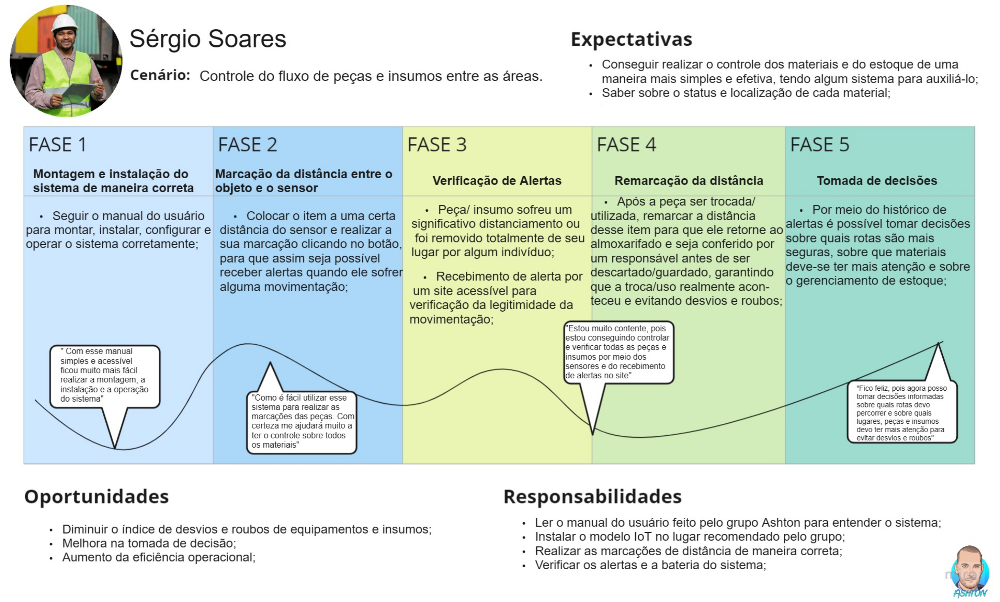
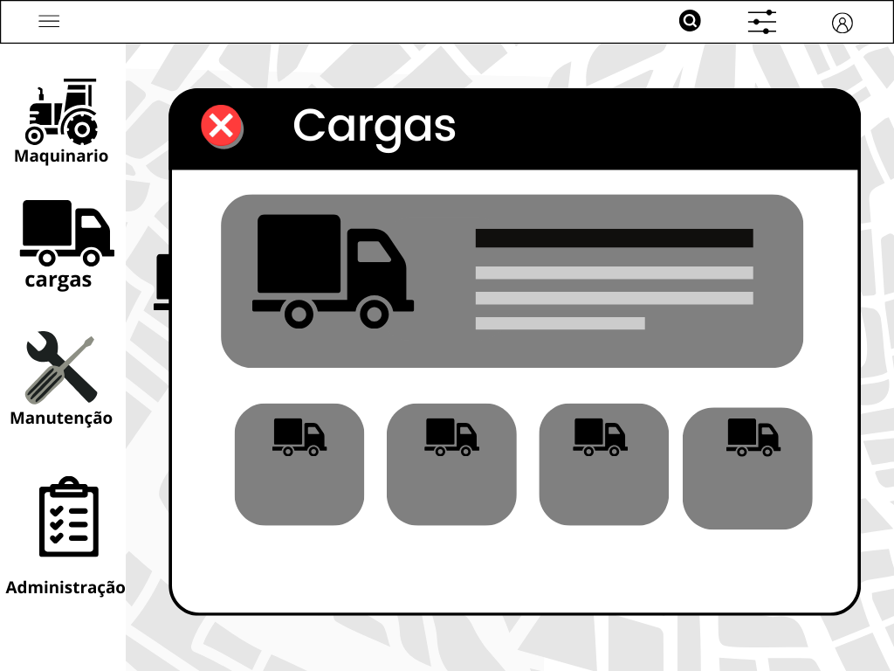

# Documentação IoTDoc - Módulo 4 - Inteli

## Ashton

#### Bruna Brasil, Felipe Fuchs, Gabriel Farias, Gabriel Macedo, Leandro Gomes, Raíssa de Cássia

## Sumário

[1. Introdução](#c1)

[2. Metodologia](#c2)

[3. Desenvolvimento e Resultados](#c3)

[4. Possibilidades de Descarte](#c4)

[5. Conclusões e Recomendações](#c5)

[6. Referências](#c6)

 

# 1. Introdução

&emsp;&emsp;A Atvos é uma empresa que se dedica à produção e comercialização de etanol, açúcar VHP e energia elétrica, utilizando cana-de-açúcar e sua biomassa como matérias-primas. Além disso, ela ocupa o posto de segunda maior produtora de etanol no Brasil e se destaca como uma das principais emissoras de Créditos de Descarbonização (CBIOs) no país. A empresa tem um compromisso sólido com a preservação do meio ambiente e um objetivo claro de contribuir para a transformação do mundo.

&emsp;&emsp;Ademais, está localizada nos estados de São Paulo, Goiás, Mato Grosso e Mato Grosso do Sul e é composta por mais de 9 mil pessoas, as quais possuem as suas ações orientadas por valores fundamentais, como respeito, colaboração, protagonismo, transparência, reconhecimento, determinação e desenvolvimento [1].

&emsp;&emsp;Além do mais, o agronegócio exige uma gestão eficaz dos recursos para garantir a produtividade e a lucratividade. Dito isso, soluções inovadoras são necessárias para lidar com desafios, tais como o controle de estoque, a rastreabilidade, status dos equipamentos rodantes, peças e insumos e prevenção de desvios e roubos, a fim de que a empresa possa atuar da melhor maneira possível e não fique prejudicada devido esses empecilhos.

## 1.1 Objetivos

&emsp;&emsp;A parceria entre o Instituto de Tecnologia e Liderança e a Atvos tem como objetivo desenvolver um modelo IoT para rastrear a localização e o status dos equipamentos rodantes, peças e insumos selecionados, visando resolver os problemas de controle de estoque, retorno desses materiais e prevenção de desvio/roubo.

&emsp;&emsp;Além disso, enquanto a solução é desenvolvida, os alunos envolvidos no projeto terão a oportunidade de aprender os conceitos necessários para o desenvolvimento do sistema e poderão aprofundar seus conhecimentos em hardware e software.

### Objetivos gerais:

&emsp;&emsp;Os objetivos gerais do projeto visam fornecer uma visão ampla do que o projeto pretende alcançar. Alguns desses objetivos são:

-Aprimoramento da rastreabilidade: uma solução para o rastreamento de insumos / materiais / equipamentos no campo, permitindo um monitoramento mais detalhado de cada recurso envolvido na operação.

-Prevenção de desvios e roubos: O sistema de alertas reduzirá consideravelmente a incidência de desvios e roubos de peças e insumos.

-Melhora na tomada de decisão: Com base nas informações coletadas, os operadores poderão tomar decisões mais informadas sobre otimização de rotas, manutenção preventiva e gerenciamento de estoques.

### Objetivos específicos:

&emsp;&emsp;Os objetivos específicos são metas mais detalhadas e concretas que contribuirão para a realização dos objetivos gerais. Eles devem ser mensuráveis e orientados para a ação. Alguns objetivos específicos são:

-Entender mais sobre quem é o parceiro por meio de uma análise de mercado;

-Fazer perguntas para o cliente com o objetivo de entender melhor suas dores;

-Construir a persona do usuário final a fim de alinhar a solução com as suas reais necessidades;

-Desenvolver um sistema de alerta para quando a peça ou insumo forem retirados do seu devido lugar;

-Aprender as tecnologias necessárias para o desenvolvimento do projeto;

-Desenvolver um protótipo da solução;

-Realização de testes para garantir que o projeto será funcional e eficiente para os usuários.

## 1.2 Proposta da solução

&emsp;&emsp;Com o objetivo de solucionar os problemas relacionados à falta de controle de estoque durante o transporte de peças e insumos entre o almoxarifado e as áreas em campo/lavoura, à ausência de informações sobre o retorno desses materiais e à prevenção de desvios e roubos, o Grupo Ashton desenvolverá um modelo IoT, o qual terá a finalidade de rastrear e alertar sobre os movimentos das peças e insumos, permitindo que os responsáveis recebam informações e tomem as medidas adequadas para evitar incidentes de roubo e desvio.

&emsp;&emsp;Em resumo, o projeto utilizará sensor ultrassônico para medir a distância entre o objeto e o sensor. Quando um item sofrer um deslocamento significativo ou for totalmente retirado para longe, um responsável receberá uma notificação, possibilitando a verificação da ação para determinar sua legitimidade. Adicionalmente, a solução incluirá um botão que permitirá a marcação da distância sempre que um novo equipamento for colocado junto ao sensor. Por fim, os alertas serão enviados ao responsável por meio de um site, proporcionando uma visualização mais detalhada das informações sobre os materiais.

## 1.3 Justificativa

&emsp;&emsp;É válido ressaltar que a proposta de solução do grupo Ashton trará inúmeros benefícios para a Atvos. Ao utilizar sensores IoT em suas peças e insumos, a empresa poderá ter o controle sobre o status desses itens em tempo real, recebendo alertas que garantirão a prevenção de desvios e roubos, além de aumentar a eficiência operacional.

&emsp;&emsp;Ademais, o projeto se diferencia das outras soluções existentes no mercado, uma vez que terá um site acessível para os usuários verificarem as informações e os alertas e realizará o rastreamento de maneira eficiente. Adicionalmente, a solução foi pensada para ser de fácil implementação, atendendo às necessidades do parceiro em relação ao problema em questão.

# 2. Metodologia

&emsp;&emsp;A Metodologia de Desenvolvimento de Sistemas Orientados a Referência (RM-ODP) [2] é um abordagem sistemática e abrangente para o desenvolvimento de sistemas distribuídos complexos. Ela se baseia em cinco visões distintas, cada uma oferecendo uma perspectiva única para analisar e descrever o sistema de forma coerente e organizada.

&emsp;&emsp;A primeira etapa, a Visão de Comportamento (Enterprise View), concentra-se nos objetivos e funções do sistema, sem se ater a detalhes de implementação. Ela define os papéis, metas, políticas e objetivos do sistema, proporcionando uma visão de alto nível sobre o propósito do sistema para os stakeholders e usuários finais.

&emsp;&emsp;A Visão de Informação (Information View), por sua vez, foca na estrutura e organização da informação dentro do sistema distribuído. Aqui, são identificados os tipos de dados que são gerenciados e processados, bem como os relacionamentos entre eles. Esta visão proporciona uma compreensão mais aprofundada sobre como as informações são manipuladas pelo sistema.

&emsp;&emsp;Na etapa da Visão de Processo (Computational View), a atenção se volta para os elementos computacionais que compõem o sistema. São detalhados os componentes de software, como processos, objetos e interfaces, além da distribuição desses elementos no ambiente distribuído. Esta visão oferece uma compreensão técnica sobre a operação do sistema.

&emsp;&emsp;A Visão de Interação (Engineering View) destaca as interfaces entre os elementos do sistema, tanto a nível de software quanto de hardware. Aqui, são especificados os protocolos de comunicação, formatos de mensagem e outros detalhes de interação entre os componentes. Essa etapa é crucial para garantir uma comunicação eficaz entre os diferentes elementos do sistema.

&emsp;&emsp;Por fim, na etapa da Visão de Implementação (Technology View), são abordados os detalhes práticos de implementação, incluindo hardware e software. São definidos os recursos físicos, sistemas operacionais, protocolos de rede e outras tecnologias que sustentam a execução do sistema distribuído.

&emsp;&emsp;Essas visões, embora distintas, são interconectadas e juntas proporcionam uma visão abrangente e integrada do sistema distribuído. A aplicação da RM-ODP facilita a compreensão, comunicação e documentação de sistemas complexos, tornando o processo de desenvolvimento mais claro e estruturado. Ela também promove uma abordagem sistemática e organizada para o desenvolvimento de sistemas distribuídos, contribuindo para o sucesso do projeto.

&emsp;&emsp;Com base no projeto, podemos aplicar a Metodologia RM-ODP. Descrevendo as etapas usando as visões da RM-ODP, obtemos:

1. **Visão de Comportamento (Enterprise View):**

    - Identificação dos objetivos e metas do projeto: Desenvolver um localizador de peças para os maquinários do agronegócio que utilize hardware com ESP32, GPS e sonares para monitorar a localização das peças e garantir a integridade do maquinário.
    - Definição das políticas de uso e segurança: Estabelecer políticas para garantir a segurança dos dados e acesso ao sistema, além de promover o uso adequado da plataforma pelos colaboradores da Atvos.

2. **Visão de Informação (Information View):**

    - Identificação dos tipos de dados: Identificar os tipos de dados a serem coletados, como localização GPS, informações dos sonares, status das peças, etc.
    - Definição dos formatos e estruturas dos dados: Especificar os formatos de dados (por exemplo, JSON para transmissão de dados entre o hardware e a plataforma web) e estruturas de dados para representar as informações coletadas.

3. **Visão de Processo (Computational View):**

    - Definição dos componentes de software: Identificar os componentes de software, incluindo o firmware para o ESP32, a lógica de processamento dos dados no hardware, e os módulos do lado do servidor para processamento e apresentação de dados na plataforma web.
    - Especificação das interfaces entre os componentes: Definir como os diferentes componentes vão interagir entre si, como os dados serão transmitidos do hardware para a plataforma web.

4. **Visão de Interação (Engineering View):**

    - Especificação das interfaces de hardware: Detalhar as interfaces de comunicação entre o ESP32, GPS, sonares e outros componentes do hardware.
    - Definição dos protocolos de comunicação: Estabelecer os protocolos de comunicação que serão usados entre o hardware e a plataforma web.

5. **Visão de Implementação (Technology View):**
    - Seleção e especificação dos recursos físicos: Escolha e especificação dos componentes físicos necessários, como o tipo de GPS, sonares, e outros sensores que serão utilizados.
    - Definição dos sistemas operacionais e tecnologias de desenvolvimento: Especificar os sistemas operacionais (por exemplo, plataforma embarcada para o ESP32) e tecnologias de desenvolvimento (linguagens de programação, frameworks, etc.) a serem utilizados.

# 3. Desenvolvimento e Resultados

## 3.1. Domínio de Fundamentos de Negócio

### 3.1.1. Contexto da Indústria

&emsp;&emsp;As Cinco Forças de Porter, concebidas por Michael E. Porter, são uma ferramenta essencial na análise da competitividade de um setor ou mercado. Essa metodologia oferece uma estrutura robusta para compreender as forças que moldam a dinâmica competitiva e o potencial de lucratividade de um negócio. Ao examinar aspectos como poder de negociação dos fornecedores, ameaça de novos entrantes e rivalidade entre concorrentes, as Cinco Forças proporcionam uma visão estratégica valiosa para orientar decisões empresariais informadas.

Figura 1: Cinco Forças de Porter

Fonte: Material produzido pelos autores (2023)

&emsp;&emsp;Após a visualização das Cinco Forças de Porter, avançaremos para uma análise mais profunda de cada uma delas. Vamos explorar o impacto do Poder de Negociação dos Fornecedores, a Ameaça de Novos Entrantes, o Poder de Negociação dos Compradores, a Ameaça de Produtos ou Serviços Substitutos e a Intensidade da Rivalidade entre os Concorrentes. Esta análise aprofundada oferecerá insights cruciais para posicionar estrategicamente o negócio em meio à concorrência e ao ambiente de mercado em constante evolução.

### 1. Rivalidade entre concorrentes:

**Quais as Ameaças?**

1. **Pressão nos preços e margens de lucro:**

-   A competição acirrada entre os concorrentes pode levar a uma redução nos preços dos produtos e, consequentemente, nas margens de lucro [3] das empresas do setor.

2. **Necessidade constante de inovação e diferenciação:**

-   Para se destacar em um mercado altamente competitivo, as empresas precisam investir em inovação [4] e na criação de produtos ou serviços diferenciados [5], o que pode exigir recursos significativos.

3. **Possibilidade de guerras de preços:**

-   Em um ambiente competitivo, os concorrentes podem ser levados a iniciar guerras de preços para ganhar participação de mercado, o que pode prejudicar a rentabilidade de todas as empresas envolvidas.

**Quais as Possíveis Reações?**

-   Buscar constante inovação e diferenciação de produtos.
-   Estabelecer estratégias de marketing e branding eficazes.
-   Explorar novos mercados e segmentos.

### 2. Poder de Barganha dos Fornecedores:

**Quem São?**

&emsp;&emsp;O poder de barganha dos fornecedores é crucial, pois determina em que medida uma empresa depende de quem fornece matéria-prima e mercadorias. A Atvos mantém relações com fornecedores essenciais para sua operação, como a John Deere [6] (maior produtora de tratores do Brasil), Bayer (segunda maior empresa de agroquímicos do mundo [7] ), JSL [8] (uma das principais empresas de logística), Google, Oracle [9], Microsoft [10], Vivo [11] (destaque em velocidade de download no Brasil) e Fendt [12].

**Quais as Ameaças?**

1. **Dependência excessiva de fornecedores específicos:**

-   Se a Atvos depender fortemente de um único fornecedor para insumos essenciais e esse fornecedor tiver um alto poder de barganha, a empresa pode enfrentar dificuldades em negociar termos favoráveis.

2. **Aumento inesperado nos custos de insumos:** Os fornecedores podem aumentar os preços dos insumos de forma inesperada, o que pode reduzir a rentabilidade da Atvos se ela não tiver alternativas viáveis de fornecedores.

3. **Falta de disponibilidade de insumos essenciais:** Em casos de escassez de determinados insumos, os fornecedores podem dar prioridade a empresas maiores ou mais lucrativas, o que pode prejudicar a produção da Atvos.

**Quais as Possíveis Reações?**

-   Diversificar a base de fornecedores e buscar alternativas de insumos.
-   Estabelecer contratos de longo prazo para garantir estabilidade de fornecimento.
-   Investir em parcerias estratégicas com fornecedores chave.

### 3. Poder de Barganha dos Compradores:

**Quem São?**

&emsp;&emsp;O poder de barganha dos compradores é outra força determinante no setor e afeta diretamente o nível de competitividade. A Atvos vende produtos como etanol, açúcar VHP e energia elétrica, e com mais de 4,7 milhões de transações de mercadorias, produtos e serviços, a empresa possui uma base considerável de compradores. Entre seus produtos, cada um possui compradores principais: A energia é vendida para cidades, o etanol é vendido para empresas como Vibra [13], Ale [14] e Raizen [15] (que serão detalhadas a seguir) e o açúcar é exportado.

1. **Vibra:**

-   A Vibra é uma das compradoras de etanol da Atvos. Trata-se de uma das maiores distribuidoras de combustíveis do Brasil, com uma presença significativa no mercado nacional. Sua dimensão e alcance conferem à Vibra um considerável poder de barganha no processo de negociação com fornecedores, incluindo a Atvos.

2. **Raizen:**

-   A Raizen é uma das gigantes no setor de energia e uma compradora estratégica para a Atvos. É uma joint venture entre a Shell e a Cosan e possui uma extensa cadeia de distribuição de combustíveis e biocombustíveis.

3. **Ale:**

-   A Ale é uma das maiores distribuidoras de combustíveis do país. Sua presença abrangente e sua posição no mercado conferem à empresa um poder de barganha considerável.

4. **Cidades (Venda de Energia):**

-   A Atvos realiza vendas de energia para municípios. Estes, ao comprarem energia da Atvos, têm o poder de exigir preços e condições contratuais que atendam aos seus interesses.

    5.**Exportação (Venda de Açúcar):**

&emsp;&emsp;A Atvos realiza exportações de açúcar VHP, isso envolve a venda de seu produto para mercados internacionais, o que pode abranger uma variedade de compradores, como empresas de distribuição, indústrias alimentícias e outras empresas que utilizam açúcar como insumo.

**Quais as Ameaças?**

1. **Redução nos preços de venda:**

-   Compradores, como a Raizen, Vibra, Ale e cidades que adquirem produtos da Atvos, têm o poder de pressionar por preços mais competitivos. Isso pode resultar em uma redução nas margens de lucro da Atvos.

2. **Possibilidade de substituição do produto:**

-   Se os compradores, incluindo Raizen, Vibra, Ale e cidades, encontrarem alternativas viáveis aos produtos da Atvos a preços mais baixos, isso pode reduzir a demanda pelos produtos da empresa.

3. **Exigências adicionais de qualidade ou serviço:**

-   Compradores como as cidades, ao serem fornecidos com energia elétrica, podem impor requisitos mais rigorosos em termos de qualidade, confiabilidade e serviço pós-venda, o que pode aumentar os custos operacionais da Atvos.

    4.**Concorrência Internacional:**

-   No mercado de exportação de açúcar VHP, a Atvos [16] enfrenta a concorrência de outros países produtores, como Índia, Tailândia, Austrália e outros. A produção desses países muitas vezes possui vantagens de escala e custos que podem influenciar os preços globais do açúcar.

**Quais as Possíveis Reações da Atvos?**

-   Focar em estratégias de fidelização de clientes, oferecendo benefícios adicionais e serviços personalizados.
-   Desenvolver soluções inovadoras para atender às exigências específicas dos compradores, como aprimorar a qualidade do produto ou serviço.
-   Investir em tecnologia e processos para otimizar a eficiência operacional, o que pode ajudar a reduzir custos e manter a competitividade em termos de preço.

### 4. Ameaça de Novos Entrantes:

**Quem são?**
Os novos entrantes representam empresas que ainda não estão estabelecidas no mercado de agroenergia, mas têm o potencial de entrar e competir.

**Quais as Ameaças?**

-   **Entrada de concorrentes com recursos significativos:** Novos entrantes com recursos substanciais para investir em P&D, infraestrutura e marketing podem representar uma ameaça, pois têm a capacidade de ganhar participação de mercado rapidamente.

-   **Tecnologias disruptivas ou inovações no setor:** Novas tecnologias ou modelos de negócios inovadores podem reduzir as barreiras de entrada e facilitar a entrada de novos competidores.

-   **Regulamentações governamentais favoráveis aos novos entrantes:** Mudanças nas regulamentações que favoreçam a entrada de novas empresas no setor podem aumentar a competição.

**Quais as Possíveis Reações?**

-   Investir em inovação e tecnologia para manter uma vantagem competitiva.
-   Fortalecer as relações com clientes existentes para garantir fidelidade.
-   Monitorar de perto as mudanças nas regulamentações do setor.

### 5. Ameaça de Produtos ou Serviços Substitutos:

**Quem são?**

&emsp;&emsp;Os produtos ou serviços substitutos são oferecidos por empresas de setores diferentes, mas podem atender à mesma necessidade ou função dos produtos da Atvos. Neste contexto, a gasolina é um produto substituto ao etanol produzido pela Atvos.

**Quais as Ameaças?**

-   **Avanços tecnológicos em produtos substitutos:** O surgimento de avanços tecnológicos em produtos ou serviços que possam substituir os produtos da Atvos pode representar uma ameaça à demanda pelos produtos da empresa.

-   **Mudanças nas preferências dos consumidores:** Se os consumidores começarem a preferir produtos ou soluções alternativas, isso pode reduzir a demanda pelos produtos da Atvos. Um exemplo seria o uso de carros elétricos [17] ao invés dos movidos a etanol.

-   **Regulamentações ambientais mais rigorosas:** Mudanças nas regulamentações ambientais que incentivem o uso de alternativas aos produtos da Atvos podem representar uma ameaça à demanda.

-   **Rendimento superior da gasolina em relação ao etanol:** A gasolina possui um rendimento energético superior em comparação ao etanol[18]. Em situações onde a eficiência energética é prioritária, a gasolina pode ser preferida, o que pode impactar a demanda pelos produtos da Atvos.

**Quais as Possíveis Reações?**

-   Monitorar continuamente o mercado e os avanços tecnológicos relevantes.
-   Investir em pesquisa e desenvolvimento para manter a competitividade.
-   Estabelecer parcerias com empresas inovadoras para explorar novas oportunidades.
-   Avaliar a viabilidade e a demanda de produtos híbridos que possam combinar o uso de etanol e gasolina.

&emsp;&emsp;Em resumo, a Atvos demonstra estar bem posicionada em relação às forças de Porter. A empresa possui uma posição competitiva sólida, é a segunda maior produtora de etanol do Brasil e um dos principais emissores de Créditos de Descarbonização (CBIOs) do país. Além disso, a empresa mantém relações estratégicas com fornecedores essenciais e enfrenta uma baixa ameaça de novos entrantes. O poder de barganha dos compradores parece equilibrado, e a ameaça de produtos substitutos é limitada. No entanto, a Atvos deve continuar monitorando a rivalidade com concorrentes e manter seus relacionamentos com fornecedores estratégicos. Esta abordagem estratégica sólida a posiciona favoravelmente em um mercado dinâmico e competitivo.

### 3.1.2. Análise SWOT

&nbsp;&nbsp;&nbsp;&nbsp;A análise SWOT [19]examina a posição de uma empresa em relação ao mercado global. Ela considera fatores ligados aos contextos interno e externo da organização, identificando o que está sob sua influência direta e o que está além dela. No contexto interno, são identificadas as “Forças” (aspectos que conferem vantagem competitiva) e “Fraquezas” (pontos vulneráveis que podem beneficiar concorrentes). Já no ambiente externo, observam-se “Oportunidades” (prospectos que podem impulsionar melhores resultados ou crescimento com base em condições favoráveis) e “Ameaças” (situações adversas que podem comprometer o progresso ou a posição da empresa no mercado).

&nbsp;&nbsp;&nbsp;&nbsp;Na sequência, apresenta-se a matriz SWOT desenvolvida pelo grupo em relação à empresa Atvos:

Figura 02 - Matriz SWOT

Fonte: Material produzido pelos autores (2023)

##### Forças

&nbsp;&nbsp;&nbsp;&nbsp;Matéria-prima sustentável e de valor: a Atvos utiliza a cana-de-açúcar como principal insumo, que representa uma fonte de energia renovável. Essa matéria-prima destaca-se pela sua capacidade de gerar energia limpa, consolidando a Atvos como uma referência em sustentabilidade no mercado.

&nbsp;&nbsp;&nbsp;&nbsp;História e trajetória consolidada: com um extenso tempo de experiência no ramo, a Atvos acumulou conhecimento profundo e expertise técnica. Esta longevidade confere à empresa uma posição de destaque e confiabilidade no setor de bioenergia.

&nbsp;&nbsp;&nbsp;&nbsp;Portfólio amplo e estratégico: a Atvos se orgulha de sua diversificação de produtos, oferecendo soluções variadas que vão além do etanol, atendendo assim a uma vasta gama de demandas do mercado. Esta diversificação fortalece sua presença e amplia suas oportunidades de negócio.

&nbsp;&nbsp;&nbsp;&nbsp;Compromisso com a inovação: a Atvos possui um evidente desejo de inovar, como demonstrado pela sua parceria com o Inteli. Essa colaboração busca não apenas aprimorar suas operações, mas também introduzir soluções tecnológicas avançadas, reforçando sua posição como líder inovadora no mercado.

&nbsp;&nbsp;&nbsp;&nbsp;Produção em grande escala: a Atvos, reconhecida pelo tamanho de sua produção, possui capacidade operacional para atender grandes demandas. A escala de sua produção não só atesta sua relevância no setor, mas também garante sua eficiência e capacidade de entrega.

##### Fraquezas

&nbsp;&nbsp;&nbsp;&nbsp;Desafios na gestão: a Atvos enfrenta uma complexidade operacional decorrente da amplitude e diversidade de suas atividades. Esta complexidade pode, em alguns momentos, desafiar a eficiência e agilidade dos processos internos.

&nbsp;&nbsp;&nbsp;&nbsp;Processo produtivo extenso: os longos ciclos de cultivo da cana-de-açúcar, inerentes à natureza desta matéria-prima, podem impactar a rapidez na resposta a demandas voláteis do mercado, exigindo planejamento meticuloso e antecipado.

&nbsp;&nbsp;&nbsp;&nbsp;Desafios ambientais: o alto consumo de água na produção agrícola[20] e industrial da Atvos apresenta preocupações ecológicas e operacionais, especialmente em regiões com restrições hídricas, podendo exigir investimentos em tecnologias de conservação.

&nbsp;&nbsp;&nbsp;&nbsp;Exigências agrárias: o uso intensivo de terra para a produção de cana-de-açúcar [21] pode limitar a diversificação agrícola e pressionar os recursos de solo, necessitando de práticas agrícolas sustentáveis e manejo adequado.

&nbsp;&nbsp;&nbsp;&nbsp;Desafios logísticos: as localidades remotas onde as operações da Atvos são conduzidas podem gerar dificuldades em logística, comunicação e acesso a recursos, o que pode aumentar os custos e afetar a eficiência da cadeia produtiva.

##### Oportunidades

&nbsp;&nbsp;&nbsp;&nbsp;Inovação através de colaborações: O mercado está em uma tendência propícia a parcerias tecnológicas e a Atvos tem a chance de fortalecer sua posição no mercado com essas parcerias, como a estabelecida com o Inteli. Estas colaborações podem acelerar a adoção de tecnologias avançadas e otimizar operações.

&nbsp;&nbsp;&nbsp;&nbsp;Legislação propícia à bioenergia: Em meio à crescente preocupação global com as mudanças climáticas, governos ao redor do mundo estão formulando e adaptando regulamentações que incentivam a produção e o consumo de energias limpas. Essas medidas, que muitas vezes se traduzem em subsídios, incentivos fiscais e metas de produção sustentável, oferecem um cenário regulatório favorável para empresas como a Atvos. Ao operar em um ambiente onde a legislação apoia e promove a bioenergia, a Atvos encontra-se em uma posição estratégica para expandir seus negócios e reforçar sua relevância no mercado energético global.

&nbsp;&nbsp;&nbsp;&nbsp;Energia limpa em alta: Com a crescente demanda global por energias renováveis, a Atvos está bem posicionada para atender a esse mercado em crescimento, beneficiando-se de sua expertise na produção de etanol e outros derivados da cana-de-açúcar.

&nbsp;&nbsp;&nbsp;&nbsp;Engajamento ecológico: O crescente interesse e apoio às causas ambientais oferece à Atvos a oportunidade de se destacar como líder em práticas sustentáveis, ganhando reconhecimento e fidelidade dos stakeholders preocupados com o meio ambiente.

&nbsp;&nbsp;&nbsp;&nbsp;Valorização do verde: O crescimento do mercado de crédito de carbono [22] representa uma oportunidade financeira e de reputação para a Atvos, incentivando práticas de produção mais limpas e reforçando seu compromisso com a sustentabilidade.

##### Ameaças

&nbsp;&nbsp;&nbsp;&nbsp;Desafios biológicos: A Atvos, como qualquer empresa agrícola, enfrenta o risco contínuo de pragas que podem afetar significativamente suas lavouras de cana-de-açúcar, comprometendo a produção e os rendimentos.

&nbsp;&nbsp;&nbsp;&nbsp;Variáveis climáticas: A dependência das condições climáticas pode trazer imprevisibilidade à produção da Atvos. Eventos climáticos extremos ou mudanças climáticas podem impactar negativamente os ciclos de cultivo.

&nbsp;&nbsp;&nbsp;&nbsp;Pressão global: No cenário internacional, a Atvos enfrenta concorrência global, onde outras regiões e países podem oferecer produtos similares a preços mais competitivos ou com vantagens logísticas.

&nbsp;&nbsp;&nbsp;&nbsp;Mercado volátil: Flutuações no preço da energia, tanto no mercado nacional quanto no internacional, podem afetar a lucratividade da Atvos, exigindo uma estratégia de precificação adaptável e ágil.

&nbsp;&nbsp;&nbsp;&nbsp;Competição com energias alternativas: Com o crescimento contínuo de fontes de energia limpa como solar e eólica, a bioenergia, embora importante, enfrenta desafios em manter sua posição no mercado de energias renováveis. A Atvos deve, portanto, estar preparada para se adaptar e competir em um mercado de energias renováveis cada vez mais diversificado.

### 3.1.3. Descrição da Solução a ser Desenvolvida

#### 3.1.3.1 Qual é o problema a ser resolvido

&emsp;&emsp;O problema a ser solucionado representa um desafio significativo para a Atvos. A falta de um rastreamento eficiente resulta em perdas substanciais de recursos, tanto financeiros quanto operacionais. Com frequência, a empresa enfrenta situações desafiadoras devido ao desaparecimento ou furto de peças cruciais, como pneus e motores de tratores. Essa realidade acarreta não apenas em prejuízos diretos, mas também gera um impacto considerável na eficiência das operações agrícolas. A busca por peças extraviadas consome tempo valioso, atrasando cronogramas e afetando a produtividade geral da lavoura. Além disso, os custos associados à substituição desses componentes de alto valor são substanciais, sobrecarregando o orçamento operacional da Atvos. Portanto, a necessidade de uma solução eficaz de rastreamento é crítica para mitigar essas dores e assegurar um funcionamento mais eficiente e seguro das operações agrícolas da empresa.

#### 3.1.3.2 Qual a solução proposta (visão de negócios)

&emsp;&emsp;A solução proposta representa um avanço tecnológico significativo para a Atvos. Ao integrar tecnologias de ponta, como GPS, Sonar e QR Code, seremos capazes de oferecer um sistema de rastreamento altamente preciso e abrangente. Essa abordagem multifacetada não apenas permitirá a localização exata das peças em tempo real, mas também oferecerá um nível adicional de segurança e eficiência operacional.
&emsp;&emsp;Além disso, ao desenvolver um dispositivo compacto e resistente, garantimos que a integração seja feita de forma discreta, sem interferir nas operações normais dos equipamentos agrícolas. Isso significa que a solução não apenas resolve o problema de rastreamento, mas o faz de forma não intrusiva, preservando a funcionalidade e a durabilidade das peças.
&emsp;&emsp;No geral, essa solução inovadora oferecerá à Atvos um novo patamar de visibilidade e controle sobre seu maquinário agrícola, proporcionando benefícios tangíveis em termos de segurança, eficiência operacional e gestão de ativos. Isso se traduzirá em uma operação mais eficaz e, consequentemente, em um aumento da produtividade e rentabilidade para a empresa.

#### 3.1.3.3 Como a solução proposta deverá ser utilizada

&emsp;&emsp;A utilização da solução será intuitiva e eficaz. Após a instalação dos dispositivos, os dados de localização serão transmitidos para um servidor central através de uma conexão segura. Os usuários poderão acessar essas informações através de um painel de controle no site desenvolvido em C# .NET. O sistema oferecerá uma interface amigável, permitindo visualizar a localização das peças em tempo real, bem como o histórico de movimentação.

#### 3.1.3.4 Quais os benefícios trazidos pela solução proposta

&emsp;&emsp;A solução proposta trará diversos benefícios para a Atvos, incluindo:

1. **Redução de Perdas:** A capacidade de rastreamento permitirá identificar e recuperar peças perdidas ou roubadas, reduzindo prejuízos financeiros.

2. **Aumento da Segurança:** A monitorização em tempo real contribuirá para a segurança das operações, minimizando o risco de furtos.

3. **Otimização de Recursos:** A localização precisa das peças facilitará a logística e gestão de inventário, evitando a necessidade de reposições desnecessárias.

4. **Tomada de Decisão Informada:** Os dados de rastreamento fornecerão insights valiosos para a gestão de operações e a tomada de decisões estratégicas.

#### 3.1.3.5 Qual será o critério de sucesso e qual medida será utilizada para o avaliar

&emsp;&emsp;O critério de sucesso será avaliado com base nos seguintes indicadores:

1. **Taxa de Recuperação de Peças:** Percentual de peças perdidas ou roubadas que foram recuperadas através do sistema de rastreamento.

2. **Redução de Perdas Financeiras:** Comparação entre os prejuízos causados por furtos e perdas antes e após a implementação da solução.

3. **Feedback dos Usuários:** Avaliação da satisfação e eficácia da solução por parte dos usuários, incluindo feedbacks e sugestões de melhorias.

4. **Eficiência Operacional:** Análise da otimização de recursos e logística obtida com a utilização da solução.

&emsp;&emsp;Para garantir a eficácia do sistema, será realizada uma fase piloto, onde a solução será implementada em uma área específica de lavoura, permitindo ajustes e refinamentos antes da implantação em larga escala. Além disso, haverá um suporte técnico dedicado para solucionar eventuais problemas e garantir a operação contínua do sistema.

### 3.1.4. Value Proposition Canvas

&emsp;&emsp;O Canvas de Proposta de Valor [23] é uma metodologia poderosa e visual que auxilia na compreensão e definição da proposta única e relevante que um produto ou serviço oferece aos seus clientes. Ao dividir os elementos-chave em segmentos específicos, este modelo proporciona uma visão clara e organizada da proposta de valor, facilitando a identificação das necessidades dos clientes e como a solução apresentada atende a essas demandas.

Figura 03 - Value Proposition Canvas

Fonte: Material produzido pelos autores (2023)

&emsp;&emsp;A seguir, vamos analisar de forma mais detalhada cada um dos componentes do Canvas de Proposta de Valor. Vamos explorar os Segmentos de Cliente, Dores e Ganhos dos Clientes, além de entender como eles se relacionam com os Segmentos do Produto, Alívio de Dores e Criadores de Ganhos. Essa análise aprofundada fornecerá insights cruciais para aprimorar e fortalecer a proposta de valor da solução em iot.

**Segmentos de Usuário:**

**Tarefas dos Usuários:**

1. **Operador de Máquinas e Implementos Agrícolas:** Estes profissionais são responsáveis por planejar e executar todas as operações relacionadas ao uso e regulagem de tratores, colhedoras e demais maquinários agrícolas ao longo de todas as fases da produção [24]. Eles desempenham um papel crucial na eficiência e produtividade da operação agrícola.

2. **Auxiliar de Almoxarifado:** Este membro da equipe assume a responsabilidade de enviar e receber materiais, realizar a separação e organização de mercadorias, apoiar na verificação e embalagem de produtos prontos, além de conferir os produtos recebidos e documentar os dados em planilhas [25]. Também é incumbido de monitorar o estoque e registrar os produtos em falta ou com baixa movimentação.

3. **Manutenção de Máquinas Agrícolas:** Estes profissionais têm a importante tarefa de realizar revisões e reparos em máquinas, motores e equipamentos mecânicos tanto agrícolas quanto industriais [26]. Além disso, são responsáveis por executar manutenções preventivas, visando otimizar o desempenho e prolongar a vida útil dos equipamentos.

**Tópico 2 - Dores dos Usuários:**

-   A falta de controle no fluxo de peças e produtos entre o almoxarifado, setor de manutenção e áreas de operação no campo gera dificuldades operacionais e pode resultar em perdas ou atrasos.

**Tópico 3 - Ganhos dos Usuários:**

-   Ao conseguir controlar efetivamente o fluxo de peças e produtos entre essas áreas, os usuários terão um processo mais fluido, eficiente e confiável. Isso resulta em uma produção mais otimizada e, consequentemente, maior produtividade.

**Segmentos do Produto:**

**Tópico 1 - Produtos e Serviços:**

-   Oferecemos um inovador rastreador integrado às peças e produtos. Este dispositivo proporciona uma solução avançada para o controle e monitoramento do fluxo de peças e produtos ao longo de todas as etapas da produção agrícola.

**Tópico 2 - Alívio de Dores:**

-   Além de oferecer um sistema de rastreamento preciso, nossa solução auxilia na responsabilização de setores específicos em casos de desaparecimento, quebra ou roubo de peças e produtos. Isso traz segurança e transparência para o processo de gerenciamento de estoque.

**Tópico 3 - Criadores de Ganhos:**

-   Além de otimizar o tempo de produção e melhorar a integração entre os setores, nossa solução proporciona uma vantagem adicional ao fornecer insights valiosos sobre o uso e movimentação de peças e produtos. Esses dados podem ser usados para aprimorar estratégias de alocação de recursos e tomadas de decisão, resultando em uma gestão mais eficaz e lucrativa.

&emsp;&emsp;Ao finalizar a análise do Value Proposition Canvas, ganhamos uma visão clara e estruturada das necessidades dos nossos clientes e de como nossa solução atende a essas demandas de maneira única e relevante. Compreender os Segmentos de Cliente, suas Dores e Ganhos, juntamente com os Segmentos do Produto, Alívio de Dores e Criadores de Ganhos, nos proporciona insights valiosos para aprimorar e fortalecer nossa proposta de valor. Este exercício é essencial para alinhar estratégias e garantir que estamos fornecendo uma solução verdadeiramente impactante e diferenciada no mercado. Agora, estamos prontos para avançar com confiança na execução e no aprimoramento contínuo da nossa proposta de valor.

### 3.1.5. Matriz de Riscos

&emsp;&emsp;Uma matriz de risco [27] é uma ferramenta essencial para avaliação e visualização dos diversos tipos de riscos que uma organização, projeto ou atividade pode enfrentar. Ela facilita a identificação, classificação e priorização dos riscos, o que é crucial para a tomada de decisões fundamentadas e o desenvolvimento de estratégias de mitigação.

&emsp;&emsp;O processo começa com a identificação minuciosa de todos os possíveis riscos associados ao projeto, processo ou operação em questão. Esses riscos podem abranger aspectos financeiros, operacionais, de segurança, regulatórios, entre outros.

&emsp;&emsp;Cada risco identificado é então classificado de acordo com critérios específicos, como a probabilidade de ocorrência e o impacto caso o risco se materialize. A probabilidade pode ser categorizada como baixa, média ou alta, enquanto o impacto pode ser avaliado em termos de leves, moderados, significativos ou críticos.

&emsp;&emsp;A matriz de risco é representada como uma tabela com duas dimensões: a probabilidade na horizontal e o impacto na vertical. Isso cria uma grade com quadrantes que representam diferentes níveis de risco.

Figura 04 - Matriz de Riscos

Fonte: Material produzido pelos autores (2023)

##### Oportunidades

&emsp;&emsp;Melhoria na Segurança: A detecção de peças com desgaste pode prevenir acidentes causados por falhas mecânicas, aumentando a segurança tanto para o operador quanto para o ambiente ao redor.

&emsp;&emsp;Coleta de Dados para Análises de Desempenho: Os dados coletados podem ser usados para análises de desempenho mais detalhadas, identificando padrões e oportunidades de otimização.

&emsp;&emsp;Aprimoramento da Tomada de Decisões: Com dados em tempo real sobre o estado das peças, os gestores podem tomar decisões mais informadas sobre a alocação de recursos e programação de manutenções.

##### Ameaças

&emsp;&emsp;Dados serem enviados com algum delay:

-   Descrição da Ameaça: Essa ameaça se refere à possibilidade de haver atrasos na transmissão de dados entre os sensores no trator e o sistema de monitoramento central. Pode ocorrer devido a problemas na conectividade, sobrecarga na rede ou falhas nos protocolos de comunicação.

-   Impacto Potencial: Atrasos na transmissão de dados podem resultar em informações desatualizadas, o que pode afetar a capacidade de resposta da equipe de manutenção. Isso pode levar a decisões baseadas em informações obsoletas, comprometendo a eficácia do sistema de rastreamento.

-   Medidas de Mitigação: Implementar redundância nas comunicações para garantir uma rota alternativa em caso de atrasos ou falhas na conexão principal.
    Estabelecer alertas para notificar a equipe em caso de atrasos significativos na transmissão de dados.

&emsp;&emsp;Quebra de um componente eletrônico:

-   Descrição da Ameaça: Refere-se à possibilidade de falha em um componente eletrônico crítico no sistema de rastreamento, como um sensor, módulo de comunicação ou unidade de processamento central.

-   Impacto Potencial: A quebra de um componente eletrônico pode resultar na interrupção do funcionamento do sistema de rastreamento. Isso pode comprometer a capacidade de detectar e rastrear peças do trator, impactando negativamente a eficiência operacional.

-   Medidas de Mitigação: Realizar manutenção preventiva regular nos componentes eletrônicos para detectar e substituir peças desgastadas antes que ocorra uma falha.
    Manter um estoque de peças de reposição essenciais para garantir uma rápida substituição em caso de falha.

&emsp;&emsp;Falha na conectividade:

-   Descrição da Ameaça: Refere-se à possibilidade de perda de conexão entre os sensores no trator e o sistema central de monitoramento devido a problemas na rede ou interferências no sinal.

-   Impacto Potencial: Uma falha na conectividade pode resultar na perda temporária de dados de monitoramento, o que pode afetar a capacidade de detectar e rastrear as peças do trator em tempo real.

-   Medidas de Mitigação: Implementar redundância nas conexões de rede, como a alternância entre Wi-Fi e redes móveis, para garantir uma conexão estável.
    Utilizar tecnologias de armazenamento local temporário para dados, permitindo que eles sejam transmitidos posteriormente em caso de perda de conexão.

### 3.1.6. Política de Privacidade de acordo com a LGPD

&emsp;&emsp;A Inteli, entidade jurídica de direito privado, com sede na Av. Prof. Almeida Prado, 520 - Butantã, São Paulo, inscrita no CNPJ/MF sob o nº 28.226.170/0001-08 (“Lojista” ou “nós”), presta a devida atenção à privacidade de seus clientes, parceiros, fornecedores e usuários (“Usuários”) da aplicação IoT e de qualquer outro site.

&emsp;&emsp;Esta Política de Privacidade [28](“Política de Privacidade”) tem o propósito de informar sobre como nós utilizamos e divulgamos informações obtidas durante as visitas à nossa aplicação IoT e nas comunicações realizadas.

&emsp;&emsp;AO ACESSAR A APLICAÇÃO IoT, ENVIAR COMUNICAÇÕES OU FORNECER QUALQUER TIPO DE DADO SENSÍVEL, DECLARA-SE ESTAR CIENTE E DE ACORDO COM ESTA POLÍTICA DE PRIVACIDADE, A QUAL DESCREVE AS FINALIDADES E MODALIDADES DE TRATAMENTO DOS DADOS SENSÍVEIS DISPONIBILIZADOS NA APLICAÇÃO IoT.

&emsp;&emsp;Esta Política de Privacidade oferece um panorama de nossas práticas de privacidade, das escolhas que podem ser exercidas e dos direitos que os titulares dos Dados Sensíveis possuem em relação aos mesmos.

&emsp;&emsp;Caso sejam enviados Dados Sensíveis referentes a outras pessoas físicas, declara-se possuir a competência necessária para fazê-lo e afirma-se ter obtido o consentimento requerido para autorizar o uso de tais informações nos termos desta Política de Privacidade.

Definições

Para os propósitos desta Política de Privacidade:

&emsp;&emsp;“Dados Pessoais” engloba qualquer informação que, de forma direta ou indireta, identifique ou possa identificar uma pessoa natural, como, por exemplo, nome, CPF, data de nascimento, endereço IP, entre outros;

&emsp;&emsp;“Dados Sensíveis” abrange qualquer informação que permita a identificação de detalhes sobre a natureza dos investimentos analisados, como, por exemplo, nome do fundo, CNPJ da empresa, entre outros dados;

&emsp;&emsp;“Dados Pessoais Sensíveis” compreende qualquer informação que revele, em relação a uma pessoa natural, a origem racial ou étnica, convicção religiosa, opinião política, filiação a sindicato ou a organização de caráter religioso, filosófico ou político, dados relativos à saúde ou à vida sexual, dados genéticos ou biométricos;

&emsp;&emsp;“Tratamento de Dados Sensíveis” compreende qualquer operação realizada no contexto dos Dados Sensíveis, por meio de meios automáticos ou não, tais como coleta, registro, organização, estruturação, armazenamento, adaptação ou alteração, recuperação, consulta, utilização, divulgação por transmissão, disseminação ou, alternativamente, disponibilização, harmonização ou associação, restrição, eliminação ou destruição. Também se considera Tratamento de Dados Sensíveis qualquer outra operação prevista nos termos da legislação aplicável;

&emsp;&emsp;“Leis de Proteção de Dados” abrange todas as disposições legais que regulam o Tratamento de Dados Pessoais, incluindo, mas não se limitando à Lei nº 13.709/18, Lei Geral de Proteção de Dados Pessoais (“LGPD”).

Uso de Dados Pessoais

&emsp;&emsp;Recolhemos e utilizamos Dados Sensíveis durante a aquisição de informações na aplicação IoT, personalizando e aprimorando a experiência. Exemplos de como utilizamos esses dados incluem:

-   Enviar informações que acreditamos ser de interesse;

&emsp;&emsp;Além disso, os Dados Sensíveis fornecidos podem ser utilizados da maneira que julgarmos necessária ou apropriada: (a) de acordo com as Leis de Proteção de Dados; (b) para cumprir exigências de processo judicial; (c) para atender decisões judiciais, regulatórias ou de autoridades competentes, incluindo autoridades fora do país de residência; (d) para proteger nossas operações; (e) para proteger nossos direitos, privacidade e segurança, bem como os de terceiros; (f) para detectar e prevenir fraude; (g) permitir-nos usar as medidas disponíveis ou limitar danos que possamos sofrer; (h) de outras formas permitidas por lei.

&emsp;&emsp;NOSSO MODELO SE DESTINA À ATVOS, PORTANTO, SOLICITAMOS QUE OUTRAS PESSOAS NÃO NOS FORNEÇAM QUALQUER DADO PESSOAL E SENSÍVEL.

Não fornecimento de Dados Sensíveis

&emsp;&emsp;Não é obrigatório compartilhar os Dados Sensíveis solicitados. No entanto, em alguns casos, se optar por não compartilhá-los, poderemos não ser capazes de fornecer acesso completo, alguns recursos especializados ou prestar a assistência necessária, bem como viabilizar a entrega do produto ou prestação do serviço contratado.

Dados coletados

&emsp;&emsp;Ao acessar a aplicação IoT, podemos coletar:

1. Informações enviadas: Dados fornecidos por meio de formulários.

2. Durante a navegação geral no modelo preditivo, podemos coletar:

-   Dados anônimos ou agregados: Aplicamos um processo de desidentificação ou minimização pseudo para tornar razoavelmente improvável a identificação através do uso desses dados com a tecnologia disponível.

-   Outras informações que podemos coletar: Informações que não revelam especificamente a identidade ou que não estão diretamente relacionadas a um indivíduo.

&emsp;&emsp;Tem o direito de, a qualquer momento, solicitar:
(i) Confirmação de que seus Dados Sensíveis estão sendo tratados;
(ii) Correções de dados incompletos, inexatos ou desatualizados;
(iii) Anonimização, bloqueio ou eliminação de dados desnecessários, excessivos ou tratados em desconformidade com a lei;
(v) Eliminação de Dados Pessoais tratados com o seu consentimento, na medida do permitido por lei; e
(ix) Revogação do consentimento.

&emsp;&emsp;Os pedidos serão tratados com especial cuidado, de modo a assegurar a eficácia dos seus direitos. Poderá ser solicitado que comprove sua identidade para garantir que a partilha dos Dados Pessoais ocorra apenas com o titular.

&emsp;&emsp;Importante lembrar que, em determinados casos (por exemplo, devido a requisitos legais), o pedido pode não ser atendido imediatamente, e pode haver situações em que não poderemos atendê-lo devido ao cumprimento de obrigações legais.
Segurança dos Dados Sensíveis

&emsp;&emsp;Buscamos implementar as medidas técnicas e organizacionais previstas pelas Leis de Proteção de Dados, apropriadas para a proteção dos Dados Sensíveis em nossa organização. Infelizmente, nenhuma transmissão ou sistema de armazenamento de dados possui garantia de ser completamente seguro. Se porventura tiver razões para acreditar que a segurança de sua interação conosco foi comprometida (por exemplo, se suspeitar que a segurança de alguma de suas contas foi violada), solicitamos que nos notifique imediatamente.

Atualizações desta Política de Privacidade

&emsp;&emsp;Em caso de alterações em nossa Política de Privacidade, publicaremos o novo texto com a data de revisão atualizada. Reservamo-nos o direito de modificar esta Política de Privacidade a qualquer momento. Se houver mudanças substanciais nos termos desta Política de Privacidade, poderemos informá-lo por meio das informações de contato que possuímos em nosso banco de dados ou por meio de notificação em nosso modelo.
Reiteramos nosso compromisso de não tratar seus Dados Sensíveis de forma inconsistente com os objetivos descritos acima, exceto se exigido por lei ou ordem judicial.
Ao continuar a usar o modelo preditivo após as alterações, você indica sua aceitação das Políticas de Privacidade revisadas. Caso, ao ler a versão atualizada, não concorde com seus termos, solicitamos que encerre o acesso ao modelo.

#### 3.1.6.1 Informações gerais sobre a empresa / organização

&emsp;&emsp;A Atvos Produz e comercializa etanol, açúcar VHP e energia elétrica a partir da cana-de-açúcar e de sua biomassa. Atualmente a Atvos é a segunda maior produtora de etanol do Brasil e um dos principais emissores de Créditos de Descarbonização (CBIOs) do país.

#### 3.1.6.2 Informações sobre o tratamento de dados

&emsp;&emsp;Esta Política de Privacidade fornece uma visão geral de nossas práticas de privacidade e das escolhas que se pode fazer, bem como direitos que podem ser exercidos em relação aos Dados Sensíveis tratados pelos desenvolved.
Caso nos envie Dados Sensíveis referentes a outras pessoas físicas,declara ter a competência para fazê-lo e declara ter obtido o consentimento necessário para autorizar o uso de tais informações nos termos desta Política de Privacidade.

#### 3.1.6.3 Quais são os dados coletados

&emsp;&emsp;Identificação, localização e o status dos equipamentos rodantes, peças e insumos que a atvos necessita de rastreamento, além da localização e identificação dos automoveis da Atvos que circulam pela planta da empresa.

#### 3.1.6.4 Onde os dados são coletados

&emsp;&emsp;Os dados serão coletados por meio do TAPI e por acordos com a Atvos durante o desenvolvimento do projeto.

#### 3.1.6.5 Para quais finalidades os dados serão utilizadas

&emsp;&emsp;Os dados seram utilizados para aprimorar o nosso sistema de monitoramento baseado em IoT e para teste da aplicação, com o intuito de entregar uma aplicação funcional para a empresa parceira.

#### 3.1.6.6 Onde os dados ficam armazenados

&emsp;&emsp;Onde os dados ficarão armazenados será de escolha da empresa parceira, a Atvos, que poderá optar por um armazenamento fisico ou armazenamento em nuvem.

#### 3.1.6.7 Qual o período de armazenamento dos dados (retenção)

&emsp;&emsp;O período de armazenamento dos dados será de escolha da Atvos, selecionando um periodo que a empresa acredite que seja o recomendavel.

#### 3.1.6.8 Uso de cookies e/ou tecnologias semelhantes

&emsp;&emsp;Não utilizaremos cookies ou tecnologias semelhantes.

#### 3.1.6.9 Com quem esses dados são compartilhados (parceiros, fornecedores, subcontratados)

&emsp;&emsp;Esses dados seram compartilhados apenas com a empresa parceira, a Atvos, e não é de nossa responsabilidade a maneira com que a empresa compartilhará esses dados recebidos pelo projeto.

#### 3.1.6.10 Informações sobre medidas de segurança adotadas pela empresa

&emsp;&emsp;A Atvos possui a própria medida de segurança, que pode ser acessada pelo site: https://atvos.com/politica-de-privacidade/

#### 3.1.6.11 Orientações sobre como a empresa/organização atende aos direitos dos usuários

&emsp;&emsp;Buscamos adotar as medidas técnicas e organizacionais previstas pelas Leis de Proteção de Dados adequadas para proteção dos Dados Sensíveis na nossa organização. Infelizmente, nenhuma transmissão ou sistema de armazenamento de dados tem a garantia de serem 100% seguros. Caso tenha motivos para acreditar que sua interação conosco tenha deixado de ser segura (por exemplo, caso acredite que a segurança de qualquer uma de suas contas foi comprometida), favor nos notificar imediatamente.

#### 3.1.6.12 Informações sobre como o titular de dados pode solicitar e exercer os seus direitos

&emsp;&emsp;Você pode, a qualquer momento, requerer: (i) confirmação de que seus Dados Sensíveis estão sendo tratados; (ii) correções a dados incompletos, inexatos ou desatualizados; (iii) anonimização, bloqueio ou eliminação de dados desnecessários, excessivos ou tratados em desconformidade com o disposto em lei; (v) eliminação de Dados Pessoais tratados com seu consentimento, na medida do permitido em lei; e (ix) revogação do consentimento. Os seus pedidos serão tratados com especial cuidado de forma a que possamos assegurar a eficácia dos seus direitos. Poderá lhe ser pedido que faça prova da sua identidade de modo a assegurar que a partilha dos Dados Pessoais é apenas feita com o seu titular.

#### 3.1.6.13 Informações de contato do Data Protection Officer (DPO) ou encarregado de proteção de dados da organização

&emsp;&emsp;Na Atvos o Encarregado da proteção de dados é o Daniel Camargo Marcondes e você poderá entrar em contato com ele sempre que necessário para esclarecer as suas dúvidas, por meio do e-mail privacidade@atvos.com.

### 3.1.7. Bill of Material (BOM)

&emsp;&emsp;A Lista de Materiais [29], frequentemente referida pela sigla BOM (Bill of Materials), é um documento essencial em qualquer projeto de engenharia e design, especialmente no campo da eletrônica. Ela fornece uma visão abrangente de todos os componentes necessários para a montagem e operação do dispositivo em questão. Cada componente listado na BOM tem uma função específica no funcionamento geral do dispositivo, e sua organização adequada garante que todos os requisitos do projeto sejam atendidos e que a montagem ocorra de maneira sistemática e eficiente.

&emsp;&emsp;A seguir, apresentamos a BOM detalhada para este projeto, incluindo a referência dos componentes na PCI, descrições, quantidades, fornecedores e o valor.

Figura 05 - Bill of Material

Fonte: Material produzido pelos autores (2023)

## 3.2. Domínio de Fundamentos de Experiência de Usuário

### 3.2.1. Personas

&emsp;&emsp;As personas [30] são representações fictícias de clientes ideais, criadas com base em dados reais e características demográficas, comportamentais e psicográficas. Elas nos ajudam a compreender melhor as necessidades, preocupações e objetivos dos diferentes perfis que interagem com um produto ou serviço. Para ilustrar esse conceito, apresentaremos três personas que representam profissionais envolvidos na problemática da gestão de peças e produtos da Atvos.

Figura 06 - Personas do projeto

Fonte: Material produzido pelos autores (2023)

&emsp;&emsp;Agora, vamos conhecer detalhadamente cada uma delas e explorar suas preocupações, objetivos e desafios individuais. Acompanhe os perfis de Madalena, Sérgio e Maurício para uma compreensão mais profunda das necessidades específicas de cada um em relação à gestão de estoque na indústria da Atvos.

Figura 07 - Persona Madalena 

Fonte: Material produzido pelos autores (2023)

&emsp;&emsp;A imagem acima representa a persona Madalena, nos trechos a seguir estão detalhados os principais pontos da imagem.

-   **Profissão:** Auxiliar de Almoxarifado
-   **Idade:** 35 anos
-   **Ambição:** Madalena almeja obter um diploma em Administração para avançar em sua carreira e assumir responsabilidades mais estratégicas na gestão do almoxarifado.
-   **Background:** Madalena trabalha como auxiliar de almoxarifado em uma empresa de médio porte que produz componentes eletrônicos. Ela é uma profissional dedicada e comprometida com o bom funcionamento do setor. Fora do trabalho, Madalena é uma pessoa tranquila e gosta de passar seu tempo livre escutando música, o que a ajuda a relaxar e recarregar energias.

-   **Preocupações:** Madalena tem uma grande preocupação com a eficiência e organização do almoxarifado. Ela sente frustração quando há perdas de peças ou produtos, pois compreende o impacto disso no processo produtivo. Acredita que a falta de organização pode gerar retrabalho e atrasos na produção, o que poderia ser evitado com um controle mais efetivo.

-   **Objetivos:** Madalena está em busca de maneiras de otimizar o controle de estoque. Seu principal objetivo é garantir que todas as peças estejam disponíveis quando necessárias. Ela deseja uma solução que traga maior transparência e confiabilidade ao processo de movimentação de itens, para que possa trabalhar com mais segurança e assertividade.

-   **Desafios:** Um dos maiores desafios de Madalena é lidar com a pressão para manter o almoxarifado organizado e preciso, mesmo diante das constantes demandas da produção. Ela busca uma solução que a ajude a identificar e corrigir rapidamente qualquer discrepância no fluxo de peças e produtos.

-   **Cenários de Interação:** Madalena interage com o sistema principalmente durante suas atividades diárias no almoxarifado. Isso inclui a entrada e saída de produtos, o registro de movimentações e a verificação do estoque disponível.

-   **Interesses e Hábitos Relacionados ao Sistema ou Produto:** Madalena valoriza soluções intuitivas e de fácil utilização. Ela está disposta a aprender a utilizar novas tecnologias, desde que isso a ajude a desempenhar melhor suas funções no almoxarifado.

-   **Nível de Letramento Digital:** Madalena possui um nível intermediário de letramento digital. Ela é capaz de utilizar sistemas de gestão de estoque e está familiarizada com as principais ferramentas de escritório.

-   **Citações Diretas:**
    -   "Manter o almoxarifado organizado é crucial para o bom funcionamento da produção."
    -   "Queria tanto ter tempo para estudar Administração e crescer na empresa."

Figura 08 - Persona Mauricio 

Fonte: Material produzido pelos autores (2023)

&emsp;&emsp;A imagem acima representa a persona Mauricio, nos trechos a seguir estão detalhados os principais pontos da imagem.

-   **Profissão:** Operador de Máquinas Agrícolas
-   **Idade:** 47 anos
-   **Ambição:** Maurício sonha em se tornar um fazendeiro, assumindo a gestão de sua própria propriedade agrícola no futuro.

-   **Background:** Maurício tem uma longa experiência como operador de máquinas agrícolas em uma fazenda de médio porte. Ele é um profissional dedicado e conhecedor do maquinário e das operações agrícolas. Fora do ambiente de trabalho, Maurício possui um interesse surpreendente pela culinária, e gosta de passar seu tempo livre experimentando novas receitas.

-   **Preocupações:** Uma das principais preocupações de Maurício é a disponibilidade de peças para as máquinas agrícolas que opera. Ele entende que a falta de algum componente pode levar a paralisações nas operações, afetando não apenas seu trabalho, mas também o cronograma de plantio e colheita estabelecido pela fazenda.

-   **Objetivos:** Maurício está em busca de uma solução que permita um controle preciso e em tempo real do estoque de peças. Seu principal objetivo é evitar situações em que a falta de um item essencial atrapalhe o andamento das operações agrícolas. Ele busca garantir a eficiência e a produtividade das máquinas sob sua responsabilidade.

-   **Desafios:** O maior desafio de Maurício é manter o trabalho eficiente e de alta qualidade, mesmo diante das incertezas relacionadas à disponibilidade das peças. Ele precisa de uma solução que o ajude a ter confiança no estoque e a evitar problemas futuros, o que é crucial para o sucesso das operações na fazenda.

-   **Cenários de Interação:** Maurício interage com o sistema principalmente durante suas atividades operacionais no campo. Isso inclui a preparação das máquinas para colheita, distribuição de adubos e outros insumos, além da verificação e, se necessário, a solicitação de reposição de peças.

-   **Interesses e Hábitos Relacionados ao Sistema ou Produto:** Maurício valoriza soluções práticas e de fácil utilização, pois seu foco principal está nas operações agrícolas. Ele está disposto a aprender a utilizar novas tecnologias, desde que isso o ajude a garantir a eficiência das máquinas.

-   **Nível de Letramento Digital:** Maurício possui um nível intermediário de letramento digital. Ele é capaz de utilizar sistemas de gestão de estoque e está familiarizado com as principais ferramentas de escritório.

-   **Citações Diretas:**
    -   "A disponibilidade de peças é crucial para manter a produção em andamento."
    -   "Sonho em ter minha própria fazenda e aplicar tudo o que aprendi como operador."

Figura 09 - Persona Sérgio 

Fonte: Material produzido pelos autores (2023)

&emsp;&emsp;A imagem acima representa a persona Sérgio, nos trechos a seguir estão detalhados os principais pontos da imagem.

-   **Profissão:** Mecânico
-   **Idade:** 42 anos

-   **Background:** Sérgio é um mecânico experiente, com uma sólida carreira na manutenção de equipamentos industriais. Ele é conhecido pela sua habilidade técnica e compromisso com a qualidade do seu trabalho. Fora do ambiente profissional, Sérgio gosta de relaxar indo a bares e é um entusiasta do futebol.

-   **Preocupações:** Sérgio está constantemente preocupado com a segurança das peças e produtos que utiliza em suas atividades. Ele compreende que, em caso de perdas ou extravios, a responsabilidade muitas vezes recai sobre os mecânicos, o que o deixa desconfortável e pode afetar o seu desempenho e reputação profissional.

-   **Objetivos:** Sérgio busca uma solução que proporcione um controle mais rigoroso sobre o fluxo de peças. Seu principal objetivo é garantir que todas estejam disponíveis e em perfeito estado quando necessárias para o reparo das máquinas, o que é crucial para manter a eficiência e a qualidade do seu trabalho.

-   **Desafios:** O maior desafio de Sérgio é manter o seu trabalho eficiente e de alta qualidade, mesmo diante das incertezas relacionadas à disponibilidade e integridade das peças. Ele precisa de uma solução que o ajude a ter confiança no estoque e a evitar problemas futuros, permitindo que se concentre no que faz de melhor: garantir o funcionamento correto dos equipamentos.

-   **Cenários de Interação:** Sérgio interage com o sistema principalmente durante suas atividades diárias de manutenção. Isso inclui a identificação e seleção de peças necessárias para os reparos, o registro de uso e a solicitação de reposição de itens no estoque.

-   **Interesses e Hábitos Relacionados ao Sistema ou Produto:** Sérgio valoriza soluções práticas e de fácil utilização, pois seu foco principal está na manutenção de equipamentos. Ele está aberto a adotar novas tecnologias, desde que isso o ajude a garantir a eficiência e segurança em seu trabalho.

-   **Nível de Letramento Digital:** Sérgio possui um nível intermediário de letramento digital. Ele é capaz de utilizar sistemas de gestão de estoque e está familiarizado com as principais ferramentas de escritório.

-   **Citações Diretas:**
    -   "A segurança das peças é uma responsabilidade que levo muito a sério."
    -   "Nada como relaxar em um bom bar após um dia de trabalho bem feito."

&emsp;&emsp;Ao conhecermos mais de perto as personas Madalena, Sérgio e Maurício, torna-se evidente a complexidade e diversidade de desafios que envolvem a gestão de peças e produtos em uma indústria de etanol. Cada um desses profissionais desempenha um papel crucial, e compreender suas necessidades individuais é fundamental para implementar soluções eficazes.

&emsp;&emsp;Através do desenvolvimento de um sistema de rastreamento, buscamos proporcionar não apenas maior controle e segurança, mas também uma abordagem personalizada para atender às demandas específicas de cada persona. Esta iniciativa visa aprimorar a eficiência operacional, minimizando perdas e assegurando que todos os elementos essenciais estejam sempre disponíveis no momento certo.

&emsp;&emsp;Com a implementação deste sistema, estamos confiantes de que Madalena, Sérgio e Maurício poderão desempenhar suas funções de forma mais eficaz, contribuindo para o sucesso e a produtividade da indústria de etanol. Juntos, avançamos na direção de uma gestão de estoque mais precisa e confiável, beneficiando todos os envolvidos no processo produtivo.

### 3.2.2. Jornadas do Usuário e Storyboard

&emsp;&emsp;O mapa da jornada do usuário [31] é uma ferramenta visual que descreve a sequência de ações que um cliente realiza com um produto ou serviço. Ele detalha cada etapa do processo, destacando as interações, as emoções do usuário, as expectativas, as oportunidades e as responsabilidades envolvidas.

&emsp;&emsp;Ademais, é válido ressaltar que a jornada do usuário desenvolvida pelo grupo Ashton é aplicável a ambas as personas, uma vez que elas compartilham o cenário de controlar o fluxo de peças e insumos entre as áreas, com a expectativa de rastrear o status e a localização de cada material, bem como garantir o controle desses itens por meio de um sistema auxiliar.

Figura 10 - Mapa de Jornada do Usuário

Fonte: Material produzido pelos autores (2023)

&emsp;&emsp;A jornada é composta por cinco fases, cada uma com suas principais ações:

-   Montagem e instalação do sistema de maneira correta: Esta etapa envolve a leitura do manual do usuário para compreender o sistema e aprender a montar, instalar, configurar e operar a solução de forma adequada. O manual é elaborado com detalhes e clareza, tornando-o acessível a usuários de todos os níveis de conhecimento.

-   Marcação da distância entre o objeto e o sensor: O manual do usuário explica como realizar essa ação de forma precisa, tornando o processo mais fácil para os usuários. Em resumo, é necessário posicionar o objeto a uma distância do sensor e marcar a sua posição pressionando um botão.

-   Verificação de Alertas: Quando uma peça ou insumo é significativamente movido ou retirado totalmente de sua localização original, o sistema emite um alerta por meio de um site, permitindo que o responsável verifique a legitimidade desse movimento.

-   Remarcação da distância: Após a substituição ou utilização de uma peça, é importante calibrar a distância do item trocado/usado para retorná-lo ao almoxarifado. Isso garante que a peça seja verificada por um responsável antes de ser descartada/guardada, prevenindo desvios e roubos.

-   Tomada de Decisões: Com base no histórico de alertas, os usuários podem tomar decisões informadas sobre como identificar rotas mais seguras, priorizar materiais e gerenciar o estoque de forma eficiente.

&emsp;&emsp;Além do nosso usuário Sérgio, também temos a Madalena, esse mapa de Jornada do usuário abaixo é uma representação visual das etapas que ela percorre ao utilizar o sistema de gestão de estoque. Ele destaca as interações, as emoções, as expectativas e as oportunidades específicas para Madalena, levando em conta seu papel como Auxiliar de Almoxarifado.

Figura 11 - Mapa de Jornada do Usuário de Madalena

Fonte: Material produzido pelos autores (2023)

-   **Fase 1: Entrada de Produtos e Registros**

-   Madalena começa o dia recebendo novos produtos no almoxarifado.
-   Ela usa o sistema para registrar a entrada de cada item, incluindo quantidade, descrição e local de armazenamento.
-   Nesta fase, Madalena sente um senso de responsabilidade em garantir que os registros sejam precisos.

-   **Fase 2: Controle de Estoque Diário**

-   Durante o dia, Madalena faz verificações regulares no estoque para garantir que os níveis estejam adequados para a produção.
-   Ela usa o sistema para visualizar as quantidades disponíveis e identificar quaisquer discrepâncias.
-   Madalena sente satisfação ao ver um estoque organizado e preciso, pois sabe que isso contribui para a eficiência da produção.

-   **Fase 3: Atendimento de Requisições de Materiais**

-   Quando um departamento solicita determinados materiais, Madalena usa o sistema para localizá-los no almoxarifado.
-   Ela registra a retirada e a movimentação dos itens, garantindo que o estoque seja atualizado em tempo real.
-   Madalena se sente confiante em sua capacidade de atender às demandas internas de forma eficiente.

-   **Fase 4: Identificação de Item Ausente**

-   Ao final do expediente, Madalena utiliza o sistema para fazer uma verificação final no almoxarifado.
-   Ela percebe que um item retirado ainda está ausente do local onde deveria estar.
-   Madalena se sente determinada a resolver essa situação antes que cause impacto nas operações.

-   **Fase 5: Registro do Desaparecimento da Peça**

-   Madalena imediatamente registra a falta do item no sistema, iniciando um processo para localizá-lo ou reabastecer o estoque.
-   Além disso, ela envia uma notificação para a pessoa que retirou a peça, avisando que é crucial que a devolva o mais rápido possível.
-   Madalena demonstra sua responsabilidade em manter o controle do estoque e sua habilidade de comunicação efetiva ao lidar com esse tipo de situação.

&emsp;&emsp;Esta jornada do usuário foi projetada para refletir as necessidades específicas e as atividades diárias de Madalena como Auxiliar de Almoxarifado. Ela destaca a importância do sistema de gestão de estoque em suas operações e demonstra como Madalena utiliza a tecnologia para garantir eficiência e precisão em seu trabalho.

&emsp;&emsp;Para que essas fases funcionem corretamente, é necessário que os usuários assumam as seguintes responsabilidades:

-Ler o manual do usuário elaborado pelo grupo Ashton para compreender o sistema.

-Instalar o modelo IoT no local recomendado pelo grupo.

-Realizar as marcações de distância de maneira precisa.

-Verificar os alertas e a bateria do sistema.

&emsp;&emsp;Portanto, os sentimentos dos usuários são de satisfação, tanto por conseguirem utilizar o sistema, visto que ele atende às suas necessidades e expectativas e torna suas tarefas mais fáceis, quanto pela implementação oferecer diversas oportunidades, incluindo:

-   Redução de desvios e roubos de equipamentos e insumos: O sistema de alertas contribuirá significativamente para diminuir a ocorrência de desvios e roubos de materiais.

-   Melhoria na tomada de decisão: Com base nas informações coletadas, os operadores estarão mais preparados para tomar decisões informadas sobre otimização de rotas, priorização de peças e gerenciamento de estoques.

-   Aumento da Eficiência Operacional: Ao agir de acordo com as necessidades e informações disponíveis, a empresa experimentará um aumento na sua eficiência operacional.

#### Storyboard

&emsp;&emsp;O storyboard [32] é uma ferramenta visual que auxilia na visualização de ideias para aprimorar a experiência do usuário. Além disso, ele comunica uma história por meio de uma sequência de imagens em painéis que mapeiam cronologicamente os eventos da narrativa.

Figura 12 - Storyboard

Fonte: Material produzido pelos autores (2023)

&emsp;&emsp;No storyboard desenvolvido pelo grupo Ashton, é contada a história de Madalena, uma auxiliar de almoxarifado. Seu objetivo principal é controlar o fluxo de peças e insumos entre as áreas, assegurando que tudo permaneça organizado e evitando perdas de itens. Madalena é meticulosa em seu trabalho; ela sempre verifica quais peças estão no almoxarifado e registra essas informações para manter tudo devidamente ordenado.

&emsp;&emsp;Quando alguém retira uma peça, Madalena faz anotações detalhadas sobre o item em sua planilha, garantindo que ela tenha um registro preciso de tudo o que sai do almoxarifado. Após um período, quando os materiais emprestados devem ser devolvidos, ela realiza uma nova verificação para confirmar que os itens foram retornados. No entanto, ao comparar as peças disponíveis com suas anotações, ela faz uma descoberta preocupante: uma das peças não foi devolvida, e não há nenhum registro do que aconteceu com ela.

&emsp;&emsp;Aqui é onde a trama se desenrola: Madalena se depara com um dilema e não tem pistas sobre o destino da peça desaparecida. Neste momento crítico, ela conhece o rastreador desenvolvido pelo grupo Ashton, uma ferramenta inovadora que auxiliará em seu trabalho e reduzirá significativamente as ocorrências de roubo e desvios como o que ela acabou de passar.

&emsp;&emsp;Além disso, há também a história de Mauricio, um mecânico, que tem como objetivo evitar situações em que a falta de um item essencial atrapalhe o andamento das operações agrícolas. Ele almeja uma solução que permita um controle preciso e em tempo real do estoque de peças.

Figura 13 - Storyboard

Fonte: Material produzido pelos autores (2023)

&emsp;&emsp;Ademais, a história conta que enquanto os funcionários, incluindo Mauricio, trabalhavam no campo, uma das peças foi roubada. Mais tarde, ao realizar uma verificação do caminhão, ele notou o desaparecimento do item e ficou decepcionado com a situação por não saber o que fazer. Foi então que ele conheceu o rastreador desenvolvido pelo grupo Ashton, o qual o deixou satisfeito por conseguir controlar as peças em tempo real, acessando apenas um site, evitando desvios e roubos e solucionado seu problema.

&emsp;&emsp;Essas histórias ilustram a importância de soluções inovadoras no ambiente de trabalho. Tanto Madalena quanto Mauricio enfrentaram desafios significativos em suas respectivas áreas, mas encontraram uma solução eficaz no rastreador desenvolvido pelo grupo Ashton.

&emsp;&emsp;O rastreador não apenas simplificou a gestão de estoque, mas também proporcionou um controle em tempo real, permitindo aos profissionais como Madalena e Mauricio manterem seus almoxarifados e operações agrícolas organizados e eficientes. Essa ferramenta demonstra como a tecnologia pode ser aliada na otimização dos processos, prevenindo perdas e aumentando a produtividade.

&emsp;&emsp;Em última análise, o storyboard apresentado não apenas narra duas histórias individuais, mas ressalta a importância de soluções customizadas para desafios específicos no ambiente de trabalho. Ao investir em inovação e tecnologia, é possível transformar situações adversas em oportunidades de crescimento e eficiência. Portanto, o rastreador desenvolvido pelo grupo Ashton representa não apenas uma ferramenta, mas uma solução que impacta diretamente a forma como profissionais como Madalena e Mauricio conduzem suas atividades diárias, demonstrando que a tecnologia pode ser a chave para o sucesso em diferentes contextos profissionais.

### 3.2.3. User Stories

&emsp;&emsp;Ao adentrar o universo das personas Madalena, Sérgio e Maurício, mergulhamos em um contexto multifacetado e desafiador da gestão de peças e produtos na indústria da Atvos. Cada um desses profissionais desempenha um papel crucial, e compreender suas necessidades individuais é fundamental para implementar soluções eficazes.

&emsp;&emsp;Através do desenvolvimento de um sistema de rastreamento personalizado, buscamos proporcionar não apenas maior controle e segurança, mas também uma abordagem individualizada para atender às demandas específicas de cada persona. Esta iniciativa visa aprimorar a eficiência operacional, minimizando perdas e assegurando que todos os elementos essenciais estejam sempre disponíveis no momento certo. Logo, para cada tipo de usuário da nossa solução são elaboradas as seguintes histórias de usuários [33]:

**Persona: Madalena (Auxiliar de Almoxarifado)**

**User Story 1:**

-   _Descrição Concisa:_

    -   Como uma auxiliar de almoxarifado, quero receber notificações em tempo real quando um produto ou peça atingir um nível crítico no estoque, para que eu possa reabastecê-lo a tempo e evitar interrupções na produção.

-   _Critérios de Aceitação:_

    -   O sistema deve enviar notificações imediatas quando a quantidade de um item atingir o limite mínimo definido.
    -   As notificações devem ser recebidas no dispositivo de Madalena por meio do site.
    -   Madalena deve ter a opção de configurar os limites mínimos para cada item.

-   _Notas ou Comentários:_

    -   Garantir que as notificações sejam claras e informativas para facilitar a ação imediata de Madalena.

-   _Prioridade:_

    -   Alta

-   _Estimativa de Esforço:_
    -   Média

**User Story 2:**

-   _Descrição Concisa:_

    -   Como uma auxiliar de almoxarifado, desejo uma funcionalidade de escaneamento de qr code no site, para facilitar a verificação e registro de produtos recebidos, garantindo a precisão e eficiência no controle de estoque.

-   _Critérios de Aceitação:_

    -   O site deve ter a capacidade de escanear qr code de produtos.
    -   A informação do produto deve ser automaticamente registrada no sistema após o escaneamento.
    -   Madalena deve ser capaz de visualizar o histórico de escaneamentos.

-   _Notas ou Comentários:_

    -   Certificar-se de que o escaneamento seja rápido e preciso para otimizar o processo de registro.

-   _Prioridade:_

    -   Média

-   _Estimativa de Esforço:_
    -   Baixa

**User Story 3:**

-   _Descrição Concisa:_

    -   Como uma auxiliar de almoxarifado, gostaria de ter acesso a relatórios detalhados sobre o movimento de produtos no almoxarifado, para que eu possa identificar padrões de demanda e tomar decisões mais informadas sobre o gerenciamento de estoque.

-   _Critérios de Aceitação:_

    -   O sistema deve gerar relatórios que incluam informações sobre a movimentação de produtos (entrada, saída, transferências, etc.).
    -   Os relatórios devem ser exportáveis em formatos comuns (PDF, Excel, etc.).
    -   Madalena deve ter a opção de filtrar os relatórios por data, tipo de movimentação, produto, entre outros.

-   _Notas ou Comentários:_

    -   Os relatórios devem ser intuitivos e de fácil interpretação para que Madalena possa tomar decisões informadas.

-   _Prioridade:_

    -   Alta

-   _Estimativa de Esforço:_
    -   Alta

**Persona: Maurício (Operador de Máquinas Agrícolas)**

**User Story 4:**

-   _Descrição Concisa:_

    -   Como um operador de máquinas agrícolas, desejo um rastreador das peças essenciais para o meu dia a dia de trabalho no campo, para que eu possa iniciar as operações de forma mais rápida e eficiente.

-   _Critérios de Aceitação:_

    -   O sistema deve apresentar uma lista de peças essenciais para o funcionamento das máquinas agrícolas.
    -   Para cada peça listada, o sistema deve fornecer a localização exata no almoxarifado.
    -   Maurício deve poder acessar essa informação a partir do seu dispositivo móvel.
    -   A informação sobre a disponibilidade das peças deve ser atualizada em tempo real.

-   _Notas ou Comentários:_

    -   Certificar-se de que o sistema seja de fácil acesso e rápido para permitir a Maurício iniciar as operações no campo sem demora.

-   _Prioridade:_

    -   Alta

-   _Estimativa de Esforço:_
    -   Média

**User Story 5:**

-   _Descrição Concisa:_

    -   Como um operador de máquinas agrícolas, desejo a capacidade de solicitar a reposição de peças diretamente pelo site, para que eu possa evitar atrasos na manutenção devido à falta de componentes.

-   _Critérios de Aceitação:_

    -   O site deve ter uma função de solicitação de reposição de peças.
    -   A solicitação deve ser enviada para o setor responsável e registrada no sistema.
    -   Maurício deve receber uma confirmação de que a solicitação foi recebida e está em processo.

-   _Notas ou Comentários:_

    -   Garantir que o processo de solicitação seja simplificado para economizar tempo para Maurício.

-   _Prioridade:_

    -   Média

-   _Estimativa de Esforço:_
    -   Baixa

**User Story 6:**

-   _Descrição Concisa:_

    -   Como um operador de máquinas agrícolas, gostaria de receber alertas quando uma peça estiver próxima do fim de sua vida útil, para que eu possa planejar a substituição de forma proativa e evitar paralisações não programadas.

-   _Critérios de Aceitação:_

    -   O sistema deve monitorar o estado das peças e enviar alertas quando uma peça estiver próxima do fim de sua vida útil.
    -   Os alertas devem incluir informações sobre a peça em questão e recomendações para substituição.
    -   Maurício deve ter a opção de configurar os limites para os alertas de vida útil.

-   _Notas ou Comentários:_

    -   Certificar-se de que os alertas sejam claros e informativos para que Maurício possa agir de forma proativa.

-   _Prioridade:_

    -   Alta

-   _Estimativa de Esforço:_
    -   Média

**Persona: Sérgio (Mecânico)**

**User Story 7:**

-   _Descrição Concisa:_

    -   Como um operador de máquinas agrícolas, quero um painel de controle que me forneça informações em tempo real sobre a disponibilidade de peças essenciais para a manutenção das máquinas agrícolas, para que eu possa garantir a continuidade das operações.

-   _Critérios de Aceitação:_

    -   O painel de controle deve exibir a lista de peças essenciais para a manutenção.
    -   As informações sobre a disponibilidade de cada peça devem ser atualizadas em tempo real.
    -   Maurício deve receber notificações quando a disponibilidade de uma peça estiver crítica.

-   _Notas ou Comentários:_

    -   O painel de controle deve ser intuitivo e de fácil navegação para facilitar o acesso às informações em tempo real.

-   _Prioridade:_
    -   Alta

**User Story 8:**

-   _Descrição Concisa:_

    -   Como um mecânico, desejo um histórico de manutenção detalhado de cada máquina, incluindo quais peças foram substituídas e quando, para que eu possa tomar decisões mais informadas sobre reparos futuros.

-   _Critérios de Aceitação:_

    -   O sistema deve manter um registro detalhado de todas as manutenções realizadas em cada máquina.
    -   O histórico de manutenção deve incluir a lista de peças substituídas e a data de cada substituição.
    -   Sérgio deve poder acessar o histórico de manutenção de forma fácil e rápida.

-   _Notas ou Comentários:_

    -   Garantir que o histórico de manutenção seja organizado e fácil de interpretar para que Sérgio possa tomar decisões informadas sobre futuras manutenções.

-   _Prioridade:_

    -   Alta

-   _Estimativa de Esforço:_
    -   Média

**User Story 9:**

-   _Descrição Concisa:_

    -   Como um mecânico, gostaria de ter a capacidade de marcar peças como "em uso" ou "em reparo" no sistema, para que eu possa evitar a utilização de componentes danificados e garantir a segurança das operações.

-   _Critérios de Aceitação:_

    -   O sistema deve permitir que Sérgio marque o estado de uma peça como "em uso", "em reparo" ou "fora de serviço".
    -   As marcações devem ser visíveis e atualizadas em tempo real para todos os usuários autorizados.
    -   Sérgio deve receber notificações sobre peças marcadas como "fora de serviço" ao tentar usá-las.

-   _Notas ou Comentários:_

    -   Garantir que as marcações sejam intuitivas e de fácil acesso para que Sérgio possa garantir a segurança das operações.

-   _Prioridade:_

    -   Alta

-   _Estimativa de Esforço:_
    -   Baixa

&emsp;&emsp;A implementação do sistema de rastreamento personalizado representa um passo significativo em direção à otimização da gestão de peças e produtos na indústria da Atvos. Ao atender às necessidades específicas de Madalena, Sérgio e Maurício, estamos promovendo uma abordagem focada no usuário final, garantindo que o software desenvolvido esteja alinhado com as necessidades reais dos clientes.

&emsp;&emsp;Estamos confiantes de que essa iniciativa não apenas facilitará o trabalho desses profissionais, mas também contribuirá para a eficiência e produtividade geral da indústria de etanol. Com a implementação deste sistema, avançamos na direção de uma gestão de estoque mais precisa e confiável, beneficiando todos os envolvidos no processo produtivo.

### 3.2.4. Protótipo de interface com o usuário

&emsp;&emsp;Os desenhos esquemáticos [34]são uma representação simplificada de um objeto, sistema ou processo que destaca suas principais características ou componentes de uma maneira clara e concisa. Além disso, em vez de se concentrar em detalhes minuciosos, utiliza símbolos, linhas e formas para comunicar as relações e a estrutura geral de um conceito ou ideia.

Figura 14 - Desenho esquemático do projeto

Fonte: Material produzido pelos autores (2023)

&emsp;&emsp;Na imagem acima, é apresentado o desenho esquemático do modelo IoT do grupo Ashton, o qual conta com: ESP32, três LEDs de cores diferentes (verde, amarelo e vermelho), resistores, botão, sensor de distância (ultrassônico) e GPS. Ademais, para melhor compreensão, na tabela a baixo é mostrado o significado de cada símbolo do desenho.

Figura 15 - Tabela símbolos

Fonte: Material produzido pelos autores (2023)

&emsp;&emsp;Além disso, na figura a seguir, é representado os materiais que serão utilizados e em qual lugar ficará cada um. Como também, uma tabela demonstrando o que cada ação representa.

Figura 16- Protótipo do projeto

Fonte: Material produzido pelos autores (2023)

&emsp;&emsp;Ademais, para verificar o desenho esquemático do projeto no figma, basta acessar o seguinte link: https://www.figma.com/file/nD3WYJn9Ak1GLkuBdC6O3c/desenhos_esquematicos_IOT?type=design&node-id=0%3A1&mode=design&t=EGkH6fzzgMIw206t-1

&emsp;&emsp;Portanto, espera-se que a partir das figuras apresentadas seja possível visualizar e compreender melhor como será o projeto IoT desenvolvido pelo grupo Ashton.

&emsp;&emsp;Além disso, para construir o protótipo, criamos um wireframe que é uma representação visual abstrata e esquemática de uma interface de usuário, caracterizada pela ausência de elementos gráficos detalhados e conteúdo final. Ele se destaca como um esboço estrutural que delineia a disposição e organização dos elementos em uma página ou aplicativo. A importância do wireframe em um projeto de monitoramento e rastreamento IoT para caminhões ou máquinas agrícolas, como o que estamos desenvolvendo, é de primordial relevância.

&emsp;&emsp;Este instrumento proporciona uma visão clara e conceitual da interface, facilitando a avaliação da funcionalidade e usabilidade do design antes de investimentos substanciais em termos de tempo e recursos no desenvolvimento integral. Adicionalmente, o wireframe facilita a comunicação efetiva entre membros da equipe e partes interessadas, assegurando uma compreensão unívoca das funcionalidades e organização dos elementos na aplicação. Tal prática promove a eficiência no desenvolvimento e atua como medida preventiva contra retrabalhos, culminando em uma economia de tempo e recursos de significativa relevância.

&emsp;&emsp;Portanto, conceber um wireframe robusto figura como um passo imperativo na concepção e no planejamento de qualquer projeto de interface de usuário, incluindo o sistema de monitoramento IoT para caminhões e máquinas agrícolas.

Figura 17 - Wireframe

Fonte: Material produzido pelos autores (2023)

&emsp;&emsp;Na imagem acima está representado o wireframe do projeto, nela estão desenhadas todas as telas que pretendemos utilizar ao longo do projeto. Cada uma dessas telas foi cuidadosamente projetada para garantir uma experiência de usuário intuitiva e eficiente. Agora, nos parágrafos a seguir, detalharemos os mockups individualmente:

### Tela de Login Mockup

&emsp;&emsp;Na figura acima está representada a página de login. Esta é a primeira tela que o usuário visualiza ao acessar o sistema. Além de fornecer um campo para inserção de credenciais, o usuário também terá a opção de se cadastrar caso seja um novo usuário ou recuperar sua senha caso a tenha esquecido.

Figura 18 - Tela de Login Mockup

Fonte: Material produzido pelos autores (2023)

### Tela Inicial Mockup

&emsp;&emsp;Esta tela serve como o ponto de partida para os usuários após o login. Nela, são apresentadas as principais funcionalidades do sistema de monitoramento IoT para caminhões e máquinas agrícolas. Cada elemento na tela foi cuidadosamente disposto para facilitar a navegação e proporcionar uma visão abrangente das atividades em tempo real.

#### Funcionalidades Destacadas:

1. **Mapa Interativo**:

    - Exibe a localização atual de todos os caminhões, distinguindo entre aqueles com cargas, sem cargas e máquinas agrícolas. Cada tipo de veículo é representado por um ícone ou marcador diferente para facilitar a identificação.

2. **Barra de Pesquisa**:

    - Permite aos usuários procurar por máquinas agrícolas, caminhões específicos ou cargas. Eles podem inserir um nome, número de identificação ou outra informação relevante para encontrar o veículo desejado.

3. **Alertas e Notificações**:
    - Ícones de alertas indicam situações importantes ou eventos críticos relacionados aos veículos, como a remoção de cargas. Ícones de notificação destacam mensagens importantes. Além disso, ícones podem indicar falta de sinal de internet para alertar sobre possíveis problemas de comunicação.

Figura 19 - Tela Inicial Mockup

Fonte: Material produzido pelos autores (2023)

### Filtros Mockup

&emsp;&emsp;Esta página representa os filtros do mapa que permitem aos usuários filtrar os veículos por tipo, como caminhões, tratores, colheitadeiras, etc., para facilitar a visualização e o acompanhamento de um determinado tipo de veículo.

Figura 20 - Filtros Mockup

Fonte: Material produzido pelos autores (2023)

### Pop-up Detalhes de Veículo Mockup

&emsp;&emsp;Ao clicar em um veículo no mapa, este pop-up exibe informações detalhadas, como número de identificação, status da carga, velocidade atual, direção, entre outras informações relevantes. Isso proporciona uma visão aprofundada do estado e atividades de cada veículo.

Figura 21 - Pop-up Detalhes de Veículo Mockup

Fonte: Material produzido pelos autores (2023)

### Pop-up Perfil Mockup

&emsp;&emsp;Nesta imagem, o usuário visualiza o seu perfil, onde encontra três botões: o "x" para fechar o pop-up, o botão inferior esquerdo para "editar" e o inferior direito para "salvar". Isso oferece ao usuário controle sobre suas configurações e informações pessoais.

Figura 22 - Pop-up Perfil Mockup

Fonte: Material produzido pelos autores (2023)

### Pop-Up Notificações Mockup

&emsp;&emsp;Esta imagem exemplifica as notificações que podem ser exibidas tanto no mapa quanto na barra lateral. Elas servem como alertas importantes sobre eventos ou situações relevantes para o monitoramento dos veículos e máquinas agrícolas.

Figura 23 - Pop-Up Notificações Mockup

Fonte: Material produzido pelos autores (2023)

&emsp;&emsp;Na imagem abaixo, apresentamos o pop-up que é acionado ao clicar no ícone "maquinário" na barra lateral. Esta tela contém informações detalhadas sobre as máquinas agrícolas ativas. O maior retângulo na imagem representa a máquina agrícola selecionada. Por padrão, o sistema escolhe automaticamente uma máquina ao abrir este pop-up, mas também é possível clicar em algum dos quadrados que contêm outras máquinas agrícolas para selecioná-las. Desta forma, a visualização do retângulo é substituída e a informação contida no quadrado é ampliada.

&emsp;&emsp;É importante destacar que na visualização detalhada (no retângulo) temos informações como o nome da máquina, o status de rastreamento (que permite ao usuário clicar para ser redirecionado ao mapa) e alertas (indicando se alguma peça desapareceu ou se está tudo em ordem). Já na visualização simplificada, temos apenas uma bolinha colorida (vermelha, amarela ou verde) representando o status daquela máquina e um ícone que indica o tipo de máquina.

&emsp;&emsp;Além disso, é relevante ressaltar que se o veículo ficar offline, a sua última localização é registrada. Quando ele retoma a conexão, se ocorrer alguma irregularidade (como o desaparecimento de uma peça), o veículo emite um alerta e indica uma área provável onde a ocorrência pode ter acontecido.

Figura 24 - Pop-Up Visualização Máquinas Agrícolas Mockup

Fonte: Material produzido pelos autores (2023)

&emsp;&emsp;De forma análoga à tela anterior, este pop-up segue a mesma estrutura de retângulo e quadrado. No entanto, ao contrário do anterior, a visualização detalhada apresenta informações sobre a carga, incluindo em qual caminhão ela está, qual é o status (se o sensor consegue verificar se a carga ainda está presente ou se desapareceu) e a localização (com a opção de redirecionamento para visualização no mapa). Assim como na visualização de máquinas agrícolas, a visualização simplificada consiste em uma bolinha colorida (vermelha para desaparecimento, amarela para perda de conexão ou verde para casos ideais) indicando o status daquela carga.

Figura 25 - Pop-Up Visualização de Cargas Mockup

Fonte: Material produzido pelos autores (2023)

&emsp;&emsp;Novamente, é importante frisar que se o veículo ficar offline, a sua última localização é registrada. Quando ele retoma a conexão, se ocorrer alguma irregularidade (como o desaparecimento de uma parte ou da carga completa), o veículo emite um alerta e indica uma área provável onde a ocorrência pode ter acontecido.

Figura 26 - Pop-Up Ferramentas Mockup

Fonte: Material produzido pelos autores (2023)

&emsp;&emsp;Na imagem acima, são apresentados três retângulos que conterão três listas: a primeira para ferramentas disponíveis, a segunda para ferramentas em uso e a terceira para ferramentas em atraso. Da esquerda para a direita, essas listas serão interativas e o usuário poderá clicar no nome da ferramenta desejada para visualizar informações adicionais, como o nome da pessoa que está com a ferramenta e outros detalhes pertinentes.

&emsp;&emsp;Estas funcionalidades são cruciais para o efetivo monitoramento e gestão de recursos no contexto do projeto em desenvolvimento. Cada elemento foi cuidadosamente planejado para fornecer uma experiência de usuário otimizada e garantir que os dados relevantes estejam facilmente acessíveis e compreensíveis.

Figura 27 - Aba de Administração Mockup

Fonte: Material produzido pelos autores (2023)

&emsp;&emsp;Na imagem acima, é apresentada a aba lateral que se abre quando o usuário clica em "Administração". Essa aba fornece acesso para adicionar novos itens (gerar QR codes) ou escanear algum item existente no sistema.

Figura 28 - Pop-Up Adição de Item Mockup

Fonte: Material produzido pelos autores (2023)

&emsp;&emsp;Nesta tela, é possível adicionar um novo item. O usuário começa selecionando o tipo de item no retângulo superior direito, escolhendo entre veículo, carga ou ferramenta. Em seguida, ele especifica o tipo específico no retângulo do meio direito (como trator, colheitadeira, fertilizante, cana de açúcar, etc.). Depois, define o destino do item, por exemplo, associando-o a uma máquina no caso de cargas. Por fim, o usuário insere a quantidade no botão do meio esquerdo. Em seguida, o usuário pode clicar em "Salvar" no canto inferior direito para gerar um QR code para cada item ou em "Cancelar" para encerrar a operação.

Figura 29 - Pop-Up Escanear Itens Mockup

Fonte: Material produzido pelos autores (2023)

&emsp;&emsp;Nesta tela, o usuário escaneia vários itens e estes são adicionados a uma lista lateral. Ao concluir o escaneamento, ele pode clicar em "Continuar" no canto direito ou em "Cancelar" no canto esquerdo para prosseguir com a operação.

Figura 30 - Pop-Up Notificações Mockup

Fonte: Material produzido pelos autores (2023)

&emsp;&emsp;Finalmente, após escanear seu item, se o usuário possuir permissões de acordo com seu cargo, ele pode marcar o item como entregue (no caso de uma ferramenta) ou concluído (no caso de uma carga), ou pode editar o veículo/pessoa que está responsável por aquele item.

&emsp;&emsp;Essas funcionalidades de administração são essenciais para garantir o gerenciamento eficiente dos recursos no contexto do projeto em desenvolvimento. Cada tela e interação foi projetada para ser intuitiva e eficaz, proporcionando aos usuários a capacidade de adicionar, rastrear e gerenciar itens de forma eficiente.

## 3.3. Solução Técnica

_Nesta seção, detalhe a especificação da solução, de acordo com o disposto nas subseções._

### 3.3.1. Requisitos Funcionais

&emsp;&emsp;Requisitos funcionais são as especificações detalhadas que descrevem as funcionalidades que um sistema deve possuir para atender às necessidades dos seus usuários e cumprir seus objetivos. Eles fornecem uma clara descrição das interações esperadas entre o sistema e seus usuários, assim como as ações que o sistema deve executar sob certas condições.

&emsp;&emsp;Os requisitos funcionais estão diretamente ligados às funcionalidades do sistema, especificando "o que" o sistema deve fazer, mas não necessariamente "como" ele deve fazê-lo. Eles são essenciais para a definição de escopo de um projeto e para a validação do sistema uma vez que ele esteja construído.

#### Dispositivo IOT

| RF   |                           Descrição                            |       User Story |
| :--- | :------------------------------------------------------------: | ---------------: |
| RF01 | Indicação de Status através das LEDs Vermelha, Amarela e Verde | US 1, 4, 6, 7, 9 |
| RF02 |  Calibragem do Sensor de Distância através de um botão físico  |          US 4, 9 |
| RF03 |   Calibragem do Sensor de Distância através de comando MQTT    |          US 4, 9 |
| RF04 |      _Schema_ JSON padronizado para ser enviado via MQTT       |    US 4, 6, 7, 9 |
| RF05 |            Envio periódico da localização via MQTT             |             US 4 |
| RF06 |               Envio de alertas de reset via MQTT               |    US 1, 4, 6, 9 |
| RF07 |         Envio de alertas de tamper (remoção) via MQTT          |          US 4, 9 |
| RF08 |                       Conectividade Wifi                       | US 1, 4, 6, 7, 9 |
| RF09 |                       Conectividade LTE                        | US 1, 4, 6, 7, 9 |
| RF10 |                       Conectividade Wifi                       | US 1, 4, 6, 7, 9 |
| RF11 |             _Subscribe_ MQTT para receber comandos             |       US 4, 6, 9 |
| RF12 |                      Medição de Distância                      |          US 4, 9 |

#### MQTT Broker

| RF   |                             Descrição                             |    User Story |
| :--- | :---------------------------------------------------------------: | ------------: |
| RF13 | Manter conexão constante via WebSockets com dispositivos/servidor |    US 4, 6, 9 |
| RF14 |                 Permitir _broadcasting_ de dados                  | US 1, 4, 6, 9 |

#### Plataforma Web

| RF   |                               Descrição                               |    User Story |
| :--- | :-------------------------------------------------------------------: | ------------: |
| RF15 |          Autenticação de Usuários através de Usuário e Senha          | US 1, 4, 6, 9 |
| RF16 |          Mapa para visualizar a localização dos equipamentos          |          US 4 |
| RF17 |                    Cadastro de novos dispositivos                     |       US 6, 9 |
| RF18 |         Relacionamento de Dispositivos com Equipamentos "pai"         |       US 6, 9 |
| RF19 |         Relacionamento de Dispositivos com um modelo de peça          |       US 6, 9 |
| RF20 | Status de estoque dos dispotivos (ex. em estoque, em uso, descartado) | US 1, 4, 7, 9 |
| RF21 |             Entrada estoque através de Leitor de QR Code              |          US 2 |
| RF22 |              Saída estoque através de Leitor de QR Code               |          US 2 |

### 3.3.2. Requisitos Não Funcionais

&emsp;&emsp;Em computação, os requisitos não funcionais [35] são os critérios que não se referem diretamente às funcionalidades específicas de um sistema, mas sim às características gerais que afetam seu desempenho, segurança, usabilidade e outros aspectos.

RNF1:
&emsp;&emsp;Descrição: A solução deve possuir alta taxa de confiabilidade.
&emsp;&emsp;Demanda do negócio: Uma vez que a solução será utilizada para localizar possíveis desvios de recursos da empresa, é de extrema importância para o usuário que a solução tenha uma alta taxa de confiabilidade. Isso permite que o usuário saiba exatamente qual item pode ter sido desviado, possibilitando um rastreamento mais eficiente e atendendo à característica de confiabilidade da ISO/IEC 25010.

RNF2:
&emsp;&emsp;Descrição: A solução deve ter uma baixa demanda de energia.
&emsp;&emsp;Demanda do negócio: Considerando que a solução será constantemente usada pelos colaboradores, para que ela se torne uma solução viável é necessário que a demanda de energia não seja grande, evitando pausas recorrentes para recargas. Isso atende à característica de eficiência de performance da ISO/IEC 25010.

RNF3:
&emsp;&emsp;Descrição: A solução deve ser intuitiva e de fácil utilização.
&emsp;&emsp;Demanda do negócio: Para que a solução seja integrada e utilizada pelos colaboradores, é necessário que ela seja intuitiva. Dessa maneira, o usuário poderá usufruir do seu potencial de rastreio de maneira mais rápida, além de ser de fácil utilização para novos usuários. Isso atende à característica de usabilidade da ISO/IEC 25010.

RNF4:
&emsp;&emsp;Descrição: A solução deve garantir a segurança dos dados coletados.
&emsp;&emsp;Demanda do negócio: A solução deve restringir o monitoramento dos itens da empresa parceira e, para manter a segurança dos dados, é necessário que as informações coletadas para realizar esse monitoramento mantenham a confidencialidade. Isso visa proteger os dados dos colaboradores contra possíveis violações de segurança ou vazamentos. Atende à característica de segurança da ISO/IEC 25010.

RNF5:
&emsp;&emsp;Descrição: A solução deve ter alta disponibilidade.
&emsp;&emsp;Demanda do negócio: Para que o monitoramento dos recursos seja feito da maneira mais eficiente possível, é necessário que a solução esteja disponível para uso dos colaboradores na maior parte do tempo, mantendo o monitoramento ativo na maior parte do tempo. Atende à característica de eficiência de performance da ISO/IEC 25010

RNF6:
&emsp;&emsp;**Descrição:** A solução deve ser compatível com os principais navegadores web.
&emsp;&emsp;**Demanda do negócio:** Considerando que os colaboradores podem utilizar diferentes navegadores para acessar a solução, é essencial que a aplicação seja compatível com os principais navegadores web, como Chrome, Firefox, Safari e Edge. Isso garante uma experiência consistente e eficiente para os usuários, atendendo à característica de compatibilidade da ISO/IEC 25010.

RNF7:
&emsp;&emsp;**Descrição:** A solução deve ser facilmente mantida e atualizada.
&emsp;&emsp;**Demanda do negócio:** A fim de garantir a eficiência contínua da solução, é necessário que ela seja facilmente mantida e atualizada. Isso permite a incorporação de melhorias, correções de bugs e adaptação a novos requisitos, sem interrupções significativas no uso da aplicação. Atende à característica de manutenibilidade da ISO/IEC 25010.

RNF8:
&emsp;&emsp;**Descrição:** A solução deve ser portátil, permitindo acesso em dispositivos móveis.
&emsp;&emsp;**Demanda do negócio:** Considerando a natureza dinâmica do ambiente de trabalho, onde os colaboradores podem precisar acessar a solução em campo, é crucial que ela seja portátil e compatível com dispositivos móveis, como smartphones e tablets. Isso proporciona flexibilidade e acessibilidade, atendendo à característica de portabilidade da ISO/IEC 25010.

Em conclusão, a definição e detalhamento dos requisitos não funcionais conforme os critérios estabelecidos pela ISO/IEC 25010 são fundamentais para assegurar o sucesso e a eficácia do projeto em desenvolvimento. Ao considerar características como confiabilidade, eficiência de performance, compatibilidade, usabilidade, segurança, manutenibilidade e portabilidade, a solução busca atender às necessidades específicas do negócio, proporcionando aos usuários uma ferramenta robusta, intuitiva e adaptável. A abordagem sistemática na identificação e especificação desses requisitos não funcionais contribui não apenas para a satisfação do usuário final, mas também para a garantia da qualidade, segurança e eficiência operacional ao longo do ciclo de vida do sistema. O alinhamento desses requisitos com as diretrizes da ISO/IEC 25010 promove um desenvolvimento de software mais consciente e orientado aos padrões de excelência em engenharia de software.

### 3.3.4. Arquitetura da Solução

&emsp;&emsp;A arquitetura da solução IoT baseia-se em um sistema de monitoramento para rastrear o desvio de peças e insumos selecionados pela Ativos. Para projetar essa solução, contamos com vários elementos interconectados que realizam uma função específica para o rastreamento ser feito de maneira efetiva.

&emsp;&emsp;A solução conta com a interconectividade entre os componentes, microcontroladores e interface web, criando um sistema de rastreamento efetivo, com monitoramento rápido e comunicação ágil com o usuário. Além disso, utilizamos o protocolo Message Queuing Telemetry Transport (MQTT) para transmissão dos dados coletados pelo módulo IoT de maneira ágil e para atender os requisitos funcionais e não funcionais citados nas seções 3.3.1 e 3.3.2.

Figura 31 - Diagrama da arquitetura

Fonte: Material produzido pelos autores (2023)

&emsp;&emsp;No video abaixo é possível visualizar uma explicação detalhada sobre cada componente, a ligação entre eles e a funcionalidade como um todo da arquitetura da solução:

https://youtu.be/Zt8YPXYpMUA

&emsp;&emsp;Logo, para garantir clareza acerca da arquitetura, os parágrafos a seguir explicam cada componente do diagrama, desde o os sensores até o dashboard.

**Microcontrolador (ESP32) [36]:**

-   É o controlador responsável pela conectividade com fio entre os componentes (sensores, LEDs, display) do módulo IoT e processa os dados coletados por esses componentes em tempo real, visando a efetividade da solução. Além disso, o ESP32 é responsável por enviar os dados coletados para o servidor por meio do broker MQTT, utilizando sua conectividade Wi-Fi para uma transmissão sem fios.

**Sensor UltrassÔnico de distância [37]:**

-   Responsável diretamente pelo monitoramento da peça rastreada, percebendo a presença do insumo a uma certa distância, que pode ser calibrada pelo pressionar de um botão presente na solução. Ao perceber a ausência da peça rastreada, envia essa informação em tempo real para o microcontrolador.

**LED:**

-   Responsável por dar um feedback visual sobre o status da peça monitorada e sobre o status do sensor de distância. A ativação do LED vermelho mostra que o sensor não está localizando a peça rastreada, a ativação do LED verde mostra que o sensor de distância está localizando a peça rastreada e a ativação do LED amarelo mostra que o sensor de distância está sendo calibrado.

**Módulo GPS [38]:**

-   Responsável por dar um feedback de localização da peça monitorada para o usuário final da solução, possibilitando que caso haja um desvio de algum insumo, os colaboradores possam saber o local em que esse desvio ocorreu.

**Display LCD [39]:**

-   O display LCD, integrado ao módulo I2C, desempenha um papel essencial na interface com o usuário. Em diferentes situações, exibe mensagens que informam o status do sistema e as interações realizadas. Por exemplo, durante a calibração da "distância segura", o LCD exibirá a mensagem "Recalibrando" para indicar o processo em andamento. Quando a detecção de remoção da carga é ativada, o display mostra "Alerta de Carga Removida", sinalizando a ocorrência desse evento.

**Broker MQTT [40]:**

-   É responsável pelo gerenciamento de mensagens entre o microcontrolador ESP32 e o sistema de processamento central. O Broker MQTT recebe os dados coletados pelo módulo IoT e encaminha essa informação para o dashboard da interface web.

**Dashboard [41]:**

-   É a interface que o usuário final terá acesso, apresentando de maneira fácil e intuitiva o status de determinada peça que está sendo monitorada, com alertas de possíveis desvios de peças e atualização em tempo real. O dashboard poderá ser acessado pelo usuário final por meio de qualquer dispositivo que possua conexão à internet. Além disso, o dashboard será desenvolvido utilixando Ubidots.

&emsp;&emsp;O funcionamento conjunto desses elementos do sistema permite um monitoramento abrangente, fornecendo informações valiosas sobre a carga, localização e status do sistema. Com essa base estrutural bem definida, é possível explorar como a arquitetura atende aos requisitos funcionais e não funcionais propostos para a solução.

&emsp;&emsp;O projeto atende aos requisitos funcionais de diversas maneiras. A indicação de status por LEDs, calibração e comunicação via MQTT, envio de alertas e a atualização periódica da localização estão alinhados com as necessidades operacionais identificadas para um rastreamento preciso e em tempo real.

&emsp;&emsp;Dessa forma, a arquitetura suporta os requisitos funcionais da seguinte maneira:

#### RF01: Indicação de status através das LEDs

_Suporte na Solução:_ As LEDs são utilizadas para informar visualmente o status do sistema, proporcionando uma rápida compreensão sobre a condição do rastreamento.

#### RF02 e RF03: Calibragem do Sensor de Distância

_Suporte na Solução:_ A calibração do sensor pode ser realizada tanto por um botão físico quanto através de um comando MQTT, proporcionando flexibilidade e facilidade de ajuste.

#### RF04: Schema JSON padronizado

_Suporte na Solução:_ O uso de um Schema JSON padronizado facilita a consistência dos dados transmitidos via MQTT, garantindo uma comunicação eficaz entre os dispositivos.

#### RF05: Envio periódico da localização via MQTT

_Suporte na Solução:_ O sistema envia periodicamente a localização, permitindo um acompanhamento contínuo da posição do recurso monitorado.

#### RF06 e RF07: Envio de alertas via MQTT

_Suporte na Solução:_ O sistema pode enviar alertas de reset e tamper (remoção) via MQTT, garantindo notificações imediatas em casos de ocorrências indesejadas.

#### RF11 e RF12: Medição de distância e comando MQTT

_Suporte na Solução:_ O sistema permite medir a distância e receber comandos via MQTT, permitindo o monitoramento preciso e a interação remota com o dispositivo.

&emsp;&emsp;Ao atender a esses requisitos, a solução proporciona disponível, compatível, de fácil manutenção, atualização e portabilidade, além de oferecer funcionalidades específicas para garantir um rastreamento eficaz e contínuo dos recursos monitorados.

&emsp;&emsp;Logo, sobre os requisitos não-funcionais a solução os atende das seguintes maneiras:

### Requisitos Não Funcionais

#### RNF1: Alta taxa de confiabilidade

_Suporte na Solução:_ A solução garante alta confiabilidade ao utilizar componentes de qualidade, processos de calibração e comunicação robusta entre dispositivos, reduzindo a probabilidade de falhas ou erros.

#### RNF2: Baixa demanda de energia

_Suporte na Solução:_ A solução emprega uma gestão eficiente de energia nos dispositivos IoT, garantindo que o consumo seja otimizado, possibilitando maior autonomia e reduzindo as pausas necessárias para recargas.

#### RNF3: Intuitividade e facilidade de uso

_Suporte na Solução:_ A interface com o usuário é intuitiva, com informações claras e de fácil entendimento, facilitando a interação e o entendimento das funcionalidades do sistema.

#### RNF4: Garantia de segurança dos dados

_Suporte na Solução:_ A solução utiliza criptografia de ponta a ponta na comunicação entre os dispositivos e a transmissão de dados, garantindo a segurança e confidencialidade das informações coletadas e transmitidas.

#### RNF5: Alta disponibilidade

_Suporte na Solução:_ O sistema é projetado para manter-se disponível na maior parte do tempo, minimizando períodos de inatividade e garantindo um monitoramento contínuo dos recursos.

#### RNF6: Compatibilidade com navegadores web

_Suporte na Solução:_ O frontend foi desenvolvido para funcionar harmoniosamente nos principais navegadores, assegurando uma experiência consistente independente do navegador utilizado pelo usuário.

#### RNF7: Facilidade de manutenção e atualização

_Suporte na Solução:_ A arquitetura foi concebida para permitir atualizações e manutenções sem interromper o uso da aplicação, garantindo a incorporação de melhorias e correções de maneira ágil.

#### RNF8: Portabilidade para dispositivos móveis

_Suporte na Solução:_ A solução foi desenvolvida de forma responsiva, adaptando-se perfeitamente a dispositivos móveis, proporcionando acesso e funcionalidade similares em diferentes plataformas.

Todas essas considerações abordadas nos requisitos acima indicam o compromisso do grupo com a promoção de um ambiente confiável, intuitivo e seguro.

&emsp;&emsp;Esses elementos permitem não apenas atender, mas também exceder as expectativas estabelecidas para os requisitos funcionais e não funcionais da solução proposta. A sinergia entre esses componentes fortalece a robustez e eficiência do sistema, garantindo um monitoramento confiável e uma experiência satisfatória para os usuários.

&emsp;&emsp;O protótipo em si é composto por sensores de distância que detectam a presença ou ausência dos insumos monitorados, LEDs que indicam visualmente o status do monitoramento, um botão para calibração do sensor de distância, um display LCD para exibir informações e um módulo GPS para rastrear a localização das peças. A interação desses componentes cria um sistema ágil e eficiente para o rastreamento de insumos.

&emsp;&emsp;Ademais, para uma compreensão mais visual e detalhada, convidamos a assistir ao vídeo demonstrativo que ilustra o funcionamento do protótipo físico, esse video está presente na seção 3.3.5 (a próxima depois dessa).

&emsp;&emsp;Com isso, a arquitetura e os elementos presentes no protótipo oferecem uma solução completa e confiável para o rastreamento de insumos, atendendo aos requisitos e garantindo a eficiência operacional da Ativos.

### 3.3.5. Arquitetura do Protótipo

&emsp;&emsp;A arquitetura do protótipo é a representação de alto nível que descreve como as várias partes de um sistema se encaixam e interagem. Ela é fundamental para qualquer projeto de desenvolvimento de produto, incluindo soluções de IoT (Internet das Coisas), como a solução de rastreamento de peças proposta para a Atvos.

&emsp;&emsp;A arquitetura do protótipo delineia os componentes principais do sistema, como sensores, microcontroladores, software, redes de comunicação e serviços de nuvem, e como eles se interconectam. Define também as principais funcionalidades e comportamentos do sistema, bem como o fluxo de dados entre os componentes.

&emsp;&emsp;A importância da arquitetura do protótipo para essa solução pode ser compreendida em vários aspectos:

1. Eficiência de desenvolvimento: Com uma arquitetura claramente definida, o projeto pode ser dividido em partes menores e mais gerenciáveis, que podem ser desenvolvidas e testadas de forma independente. Isso ajuda a identificar problemas mais cedo e reduz o risco de retrabalho posterior.

2. Integração de sistemas: A arquitetura assegura que todas as partes do sistema funcionem juntas de maneira eficaz. Isso é especialmente importante em soluções de IoT, onde há uma interação complexa entre vários dispositivos e a nuvem.

3. Escalabilidade: Uma boa arquitetura permite que a solução cresça e se adapte com o tempo. Por exemplo, pode ser necessário adicionar mais sensores ou alterar a maneira como os dados são processados à medida que a quantidade de dados aumenta.

4. Segurança: A segurança é uma consideração importante em qualquer solução de IoT. A arquitetura do protótipo deve incluir considerações de segurança, como a maneira como os dados são criptografados e como os dispositivos são autenticados.

5. Confiabilidade: A arquitetura do protótipo pode contribuir para garantir que o sistema seja confiável e capaz de lidar com falhas de maneira adequada. Isso é especialmente importante em um ambiente de produção, onde falhas de sistema podem ter um impacto significativo na operação.

&emsp;&emsp;No contexto do projeto para a Atvos, a arquitetura do protótipo ajudará a definir como os sensores de rastreamento são conectados aos caminhões oficina, como os dados de rastreamento são transmitidos e processados, e como as informações de rastreamento são apresentadas aos usuários. Também ajudará a identificar quaisquer requisitos de segurança para prevenir furtos ou desvios de peças.

&emsp;&emsp;A seguir, temos um vídeo explicativo sobre o diagrama e as tecnologias utilizadas. Nesse vídeo passamos pelos componentes utilizados e como eles estão conectados entre si. Ao final, temos dois _prints_ demonstrando os estados da plataforma Ubidots, quando o objeto está na posição correta e quando não está.

https://youtu.be/EcBqwXRW7d8

Figura 32 - Diagrama da arquitetura

Fonte: Material produzido pelos autores (2023)

| **Componente**      | **Descrição**                                                                                                                                                                                                        | **Tipo**                   |
| ------------------- | -------------------------------------------------------------------------------------------------------------------------------------------------------------------------------------------------------------------- | -------------------------- |
| Sensor de LED       | O sensor de LED é um dispositivo que detecta a presença ou ausência de luz. Ele pode ser usado para identificar se uma fonte de luz está ativa ou não em um ambiente específico.                                     | Sensor                     |
| Botão               | O botão é um componente simples de entrada que pode ser pressionado ou ativado para enviar um sinal elétrico quando pressionado. É comumente utilizado para iniciar ou interromper funções em um sistema eletrônico. | Dispositivo de Entrada     |
| Sensor de Distância | O sensor de distância é um dispositivo capaz de medir a distância entre ele próprio e um objeto alvo. Utilizando diferentes tecnologias, como ultrassom, infravermelho ou laser, determina a distância.              | Sensor                     |
| Display             | O display é um componente visual que apresenta informações de forma legível ao usuário, podendo ser LCD, OLED ou LED. É usado para exibir dados, gráficos ou mensagens em sistemas eletrônicos.                      | Dispositivo de Saída       |
| GPS                 | O GPS (Sistema de Posicionamento Global) fornece coordenadas precisas de localização em tempo real em qualquer lugar do mundo, utilizando uma rede de satélites para calcular a posição de um receptor.              | Dispositivo de Localização |

### 3.3.6. Arquitetura Refinada da Solução (sprint 5)

&emsp;&emsp;A arquitetura técnica revisada do nosso sistema de rastreamento de peças de maquinário agrícola é composta por três partes principais: o dispositivo IoT, o broker MQTT e a plataforma web. 

&emsp;&emsp;O dispositivo IoT é o componente físico que será anexado às peças do maquinário agrícola. Este dispositivo é equipado com um módulo GPS e conectividade WiFi e LTE para transmitir a localização das peças em tempo real para o broker MQTT. Ele também inclui sensores de distância e LEDs para indicar o status do dispositivo. A calibragem do sensor de distância pode ser realizada através de um botão físico ou de um comando MQTT. O dispositivo IoT também está configurado para enviar alertas de reset e tamper (remoção) via MQTT. O dispositivo IoT atende aos requisitos funcionais RF01 a RF12.

&emsp;&emsp;O broker MQTT é o servidor que recebe as informações de localização do dispositivo IoT e as transmite para a plataforma web. Ele mantém uma conexão constante via WebSockets com os dispositivos e o servidor, permitindo o broadcasting de dados. O broker MQTT atende aos requisitos funcionais RF13 e RF14.

&emsp;&emsp;A plataforma web é a interface do usuário onde os dados de localização são visualizados. Ela inclui funcionalidades para autenticação de usuários, visualização de localização no mapa, cadastro de novos dispositivos, relacionamento de dispositivos com equipamentos "pai" e modelos de peça, status de estoque, e leitura de QR Code para entrada e saída de estoque. A plataforma web atende aos requisitos funcionais RF15 a RF22.

&emsp;&emsp;A arquitetura técnica revisada suporta os requisitos funcionais e não funcionais do sistema. Ela fornece uma solução confiável (RNF1) com uma baixa demanda de energia (RNF2) para rastrear a localização das peças do maquinário agrícola. A interface da plataforma web é intuitiva e de fácil utilização (RNF3), e a segurança dos dados coletados é garantida (RNF4). A solução tem alta disponibilidade (RNF5) e é compatível com os principais navegadores web (RNF6). Além disso, a arquitetura permite fácil manutenção e atualização da solução (RNF7) e é portátil, permitindo acesso em dispositivos móveis (RNF8).

&emsp;&emsp;Os ajustes feitos na arquitetura técnica incluem a substituição do rastreamento manual pelo GPS, a adição de antenas externas para melhorar a recepção do sinal GPS, e a implementação de uma plataforma web para visualização dos dados. Esses ajustes foram realizados para melhorar a confiabilidade, eficiência, e usabilidade da solução, e para atender aos requisitos funcionais e não funcionais do sistema.

Figura 33 - Diagrama da Arquitetura da Solução

Fonte: Material produzido pelos autores (2023)

&emsp;&emsp;Em conclusão, a arquitetura técnica revisada do sistema de rastreamento de peças de maquinário agrícola apresenta uma solução abrangente e eficiente para acompanhar a localização das peças em tempo real. A combinação do dispositivo IoT, o broker MQTT e a plataforma web permite a coleta, transmissão e visualização dos dados de forma integrada e intuitiva.

&emsp;&emsp;O dispositivo IoT desempenha um papel crucial ao ser anexado às peças do maquinário e transmitir informações de localização através de GPS e conectividade WiFi e LTE. Além disso, a presença de sensores de distância e LEDs permite indicar o status do dispositivo, enquanto a calibragem pode ser facilmente realizada através de um botão físico ou comando MQTT. Essa abordagem proporciona uma maneira eficiente de monitorar as peças e receber alertas em caso de reset ou remoção.

&emsp;&emsp;O broker MQTT atua como um servidor intermediário, recebendo as informações de localização do dispositivo IoT e transmitindo-as para a plataforma web. Essa comunicação constante é estabelecida através de WebSockets, permitindo a transmissão em tempo real dos dados coletados. Com isso, é possível garantir a disponibilidade e a confiabilidade do sistema.

&emsp;&emsp;A plataforma web é a interface do usuário, onde os dados de localização são visualizados e gerenciados. Ela oferece recursos como autenticação de usuários, visualização de localização no mapa, cadastro de dispositivos, relacionamento com equipamentos, modelos de peças e status de estoque. Essa interface intuitiva e de fácil utilização proporciona uma experiência amigável aos usuários, permitindo que eles acompanhem as peças de forma eficiente.

&emsp;&emsp;A arquitetura técnica revisada também atende aos requisitos não funcionais do sistema. Ela fornece uma solução confiável, com baixa demanda de energia, alta disponibilidade e compatibilidade com os principais navegadores web. Além disso, a segurança dos dados coletados é garantida, e a arquitetura é facilmente mantida e atualizada. A portabilidade da solução permite que ela seja acessada em dispositivos móveis, ampliando sua usabilidade.

&emsp;&emsp;Os ajustes realizados na arquitetura técnica foram fundamentais para melhorar a confiabilidade, eficiência e usabilidade do sistema. A substituição do rastreamento manual pelo GPS e a adição de antenas externas para melhorar a recepção do sinal GPS contribuíram para uma coleta mais precisa e confiável dos dados de localização. A implementação da plataforma web trouxe uma interface intuitiva e de fácil utilização, permitindo que os usuários visualizem e gerenciem as informações de forma eficiente.

&emsp;&emsp;Em suma, a arquitetura técnica revisada do sistema de rastreamento de peças de maquinário agrícola é uma solução completa e eficiente que atende aos requisitos funcionais e não funcionais. Ela proporciona uma maneira confiável e intuitiva de rastrear a localização das peças, permitindo um gerenciamento mais eficiente e uma tomada de decisão embasada. Com essa arquitetura, o sistema está preparado para melhorar a eficiência e a produtividade no setor agrícola, trazendo benefícios tanto para os produtores quanto para os usuários finais.

## 3.4. Resultados

_Nesta seção, detalhe os resultados obtidos com a implementação, de acordo com o disposto nas subseções._

### 3.4.1.Protótipo Inicial do Projeto usando o Simulador Wokwi

&emsp;&emsp;O primeiro teste do protótipo do dispositivo foi feito no Simulador Wokwi e pode ser visto [neste link](https://wokwi.com/projects/379039670070684673). Para executá-lo, siga as instruções abaixo:

1. Acesse [este site](https://www.hivemq.com/demos/websocket-client/) para ver os dados via MQTT;
2. Troque o conteúdo do campo "host" para `broker.hivemq.com`
3. Clique no botão "Connect"
4. Ao lado direito da tela, clique em "Add new Topic subscription"
5. No modal troque o "Topic" para `grupo3/broadcast`
6. Clique em Subscribe
7. Abra o [simulador](https://wokwi.com/projects/379039670070684673)
8. Clique no botão redondo verde
9. Clique no Sonar e arraste-o para 200cm
10. Segure o Pushbutton até a LED amarela piscar (definindo o limite de distância para disparar o alarme).

&emsp;&emsp;Após seguir essas instruções para utilizar o protótipo inicial do projeto, execute alguns dos cenários listados na tabela abaixo para testá-lo.

| **#** | **Bloco**            | **Componente de entrada** | **Leitura da entrada**      | **Componente de saída** | **Leitura da saída**                          | **Descrição**                                                      |
| ----- | -------------------- | ------------------------- | --------------------------- | ----------------------- | --------------------------------------------- | ------------------------------------------------------------------ |
| 01    | Medidor de distância | Sensor Sonar              | Distância > Limite definido | LED Vermelha            | Ligado                                        | LED Vermelha ligada quando TAMPER disparado                        |
| 02    | Medidor de distância | Sensor Sonar              | Distância > Limite definido | Monitor Serial          | Texto "TAMPER!" printado                      | TAMPER notificado via Monitor Serial                               |
| 03    | Medidor de distância | Sensor Sonar              | Distância < Limite definido | LED Verde               | Ligado                                        | LED Verde ligada quando TAMPER não está disparado                  |
| 04    | Medidor de distância | PushButton                | Pressionado                 | LED Amarelo             | Aceso até soltar                              | RESET do limite de distância notificado via LED Amarela            |
| 05    | Medidor de distância | PushButton                | Pressionado                 | Monitor Serial          | Texto "RESET!" printado                       | RESET do limite de distância notificado via Monitor Serial         |
| 06    | Geral                | MQTT Broker               | Conectado                   | Monitor Serial          | Texto "Connected to MQTT broker" printado     | Conexão com broker MQTT notificada via Monitor Serial              |
| 07    | Geral                | MQTT Broker               | Erro ao Conectar            | Monitor Serial          | Texto "MQTT failed to connect" printado       | Falha na conexão com broker MQTT notificada via Monitor Serial     |
| 08    | Geral                | MQTT Broker               | Conectando                  | Monitor Serial          | Texto "Connecting to MQTT broker..." printado | Tentativa de conexão com broker MQTT notificada via Monitor Serial |

&emsp;&emsp;A seguir, será possível visualizar alguns testes realizados no protótipo por meio do simulador Wokwi.

#### Fotos dos Testes

&emsp;&emsp;Na figura abaixo, foi feito um teste de redefinição da distância, onde a luz amarela piscará durante a nova calibragem e a luz verde indicará a conclusão bem-sucedida, indicando que o dispositivo está pronto para uso.

Figura 34 - Redefinição do Limite de Distância

Fonte: Material produzido pelos autores (2023)

&emsp;&emsp;Além disso, a mensagem de redefinição de distância foi enviada por MQTT.

Figura 35 - Aviso de Redefinição por MQTT

Fonte: Material produzido pelos autores (2023)

&emsp;&emsp; Ademais, com a luz verde acesa, há a indicação de que o modelo IoT está pronto para ser utilizado, emitindo alertas quando algo sofrer uma movimentação em relação à distância calibrada.

Figura 36 - Sensor sem Tamper (estado normal/verde)

Fonte: Material produzido pelos autores (2023)

&emsp;&emsp;Na seguinte imagem, o objeto parado em frente ao sensor sofreu um deslocamento, acendendo a luz vermelha e emitindo um sinal de alerta.

Figura 37 - Sensor com Tamper

Fonte: Material produzido pelos autores (2023)

&emsp;&emsp; O alerta também foi enviado por MQTT.

Figura 38 - Aviso de Tamper por MQTT

Fonte: Material produzido pelos autores (2023)

&emsp;&emsp; Portanto, ao realizar os testes apresentados nas figuras e testar as entradas e saídas indicadas na tabela, é possível concluir que o protótipo inicial do projeto é funcional, dando início à construção do protótipo físico.

### 3.4.2. Protótipo Físico do Projeto (offline)

No desenvolvimento de sistemas físicos, é crucial realizar uma bateria abrangente de testes para garantir o funcionamento eficaz e confiável do protótipo. Estes testes vão além dos casos ideais, explorando cenários diversos, desde situações de sucesso até possíveis falhas nas leituras de entradas e saídas. Essas avaliações são essenciais para assegurar a robustez do sistema em situações do mundo real e para proporcionar uma experiência de usuário consistente.

Para registrar e ilustrar as diversas situações de teste enfrentadas pelo nosso sistema físico, apresentaremos exemplos de leituras de entrada e saída, utilizando as nomenclaturas e convenções estabelecidas anteriormente. Além disso, destacaremos os alinhamentos de negócios e as considerações de experiência do usuário que foram incorporados ao protótipo. Logo abaixo, está o link para o video de demonstração do protótipo fisíco:

[Clique aqui para ver o vídeo do protótipo](https://youtu.be/yQmzm-cnjGM)

A tabela abaixo serve como um exemplo inicial para orientar a documentação dos testes realizados, abrangendo casos de sucesso, bem como possíveis falhas nas leituras de entradas e saídas:

| **#** | **Descrição**        | **Pré-condição** | **Procedimento de teste**   | **Pós-condição/Resultado esperado** | **Observações** (opcional)    |                |
| ----- | -------------------- | ---------------- | --------------------------- | ----------------------------------- | --------------------------------------------- | ------------------------------------------------------------------ |
| 01    | Medidor de distância | Sensor Sonar     | Distância > Limite definido | LED Vermelha                        | Ligado                                        | LED Vermelha ligada quando TAMPER disparado                        |
| 02    | Medidor de distância | Sensor Sonar     | Distância > Limite definido | Monitor Serial                      | Texto "TAMPER!" printado                      | TAMPER notificado via Monitor Serial                               |
| 03    | Medidor de distância | Sensor Sonar     | Distância < Limite definido | LED Verde                           | Ligado                                        | LED Verde ligada quando TAMPER não está disparado                  |
| 04    | Medidor de distância | PushButton       | Pressionado                 | LED Amarelo                         | Aceso até soltar                              | RESET do limite de distância notificado via LED Amarela            |
| 05    | Medidor de distância | PushButton       | Pressionado                 | Monitor Serial                      | Texto "RESET!" printado                       | RESET do limite de distância notificado via Monitor Serial         |
| 06    | Geral                | MQTT Broker      | Conectado                   | Monitor Serial                      | Texto "Connected to MQTT broker" printado     | Conexão com broker MQTT notificada via Monitor Serial              |
| 07    | Geral                | MQTT Broker      | Erro ao Conectar            | Monitor Serial                      | Texto "MQTT failed to connect" printado       | Falha na conexão com broker MQTT notificada via Monitor Serial     |
| 08    | Geral                | MQTT Broker      | Conectando                  | Monitor Serial                      | Texto "Connecting to MQTT broker..." printado | Tentativa de conexão com broker MQTT notificada via Monitor Serial |

A seguir, serão apresentadas figuras do protótipo físico, acompanhadas de descrições detalhadas dos testes realizados para demonstrar o funcionamento do sistema em diferentes contextos.

#### Fotos dos Testes

Figura 39: Redefinição do Limite de Distância

Fonte: Autoria Própria

Nesta imagem, é demonstrado o teste de redefinição do limite de distância. O sistema foi ajustado para aceitar um novo limite, e a resposta foi validada conforme as coordenadas da máquina se aproximavam da nova configuração.

Figura 40: Aviso de Redefinição por MQTT

Fonte: Autoria Própria

O aviso de redefinição por MQTT é ilustrado nesta imagem. Após a alteração do limite de distância, o sistema envia uma notificação por MQTT para informar a mudança ao servidor, garantindo uma comunicação eficaz.

Figura 41: Sensor sem Tamper (estado normal/verde) (repare no estilete)

Fonte: Autoria Própria

Aqui, é apresentado o sensor em seu estado normal, indicado pela luz verde. A presença do estilete confirma a integridade do sensor, sendo um teste essencial para verificar a ausência de violações.

Figura 42: Sensor com Tamper (repare na falta do estilete)

Fonte: Autoria Própria

A imagem exibe o sensor com a detecção de tamper, evidenciada pela ausência do estilete. Essa condição aciona um alerta no sistema para indicar possíveis violações.

Figura 43: Aviso de Tamper por MQTT

Fonte: Autoria Própria

O aviso de tamper por MQTT é apresentado, indicando que o sistema detectou uma tentativa de violação. Este alerta é enviado ao servidor por meio do protocolo MQTT, proporcionando uma resposta imediata a eventos críticos.

Estes exemplos servem como um guia inicial para a documentação das situações de teste. A seguir, serão apresentadas figuras do protótipo físico, acompanhadas de descrições detalhadas dos testes realizados para ilustrar o funcionamento do sistema em diferentes cenários.

### 3.4.3. Protótipo do Projeto com MQTT e I2C

O sistema de rastreamento de caminhões agrícolas é uma solução IoT integrada, composta por dispositivos como ESP32, módulos GPS, sensores de distância e protocolo MQTT para comunicação eficiente. Seu propósito é monitorar o transporte de cargas, como fertilizantes, garantindo acompanhamento preciso e seguro.

Este registro explora variados cenários de uso do sistema, abrangendo interações do usuário e respostas esperadas em diferentes contextos, inclusive falhas. Visa-se aprimorar a robustez, confiabilidade e segurança do sistema.

Em um cenário ideal, o protótipo apresenta a seguinte configuração:

Figura 44: Aviso de Tamper por MQTT

Fonte: Autoria Própria

Cada situação descreve não apenas casos ideais, mas também a preparação do sistema para lidar com falhas potenciais, garantindo a segurança da carga, integridade dos dados e eficiência operacional.

**Tabela de Cenários de Uso do Sistema de Rastreamento de Caminhões Agrícolas via MQTT e Módulo I2C:**

| **#** | **Configuração do Ambiente**                                                 | **Ação do usuário**                                                          | **Resposta esperada do sistema**                                                                                                                                                                                           |
| ----- | ---------------------------------------------------------------------------- | ---------------------------------------------------------------------------- | -------------------------------------------------------------------------------------------------------------------------------------------------------------------------------------------------------------------------- |
| 01    | Esp32, sensor de distância e módulo I2C instalados no caminhão agrícola.     | Sensor de distância percebe a remoção da carga (por exemplo, fertilizantes). | O sistema ESP32 publica uma mensagem no tópico MQTT designado para alertas de remoção de carga. Se o sensor de distância falhar em detectar a remoção da carga, não será emitido nenhum alerta MQTT.                       |
| 02    | Interface de configuração conectada ao ESP32.                                | Usuário calibra a "distância segura" para a carga atual no caminhão.         | O ESP32 publica um alerta no tópico MQTT específico indicando a calibração da "distância segura". Se a calibração for bem-sucedida, mas a publicação MQTT falhar, o sistema não registrará a nova distância segura.        |
| 03    | Módulo GPS integrado ao sistema IoT.                                         | Sistema captura atualizações de localização do caminhão agrícola.            | Os dados de localização são publicados em intervalos regulares no tópico MQTT dedicado às informações de localização. Se houver uma interrupção no sinal GPS, as atualizações de localização não serão publicadas no MQTT. |
| 04    | Aplicativo ou plataforma conectada ao tópico MQTT para monitoramento remoto. | Usuário verifica o status da carga (presente ou removida) remotamente.       | O sistema publica periodicamente o status da carga (presente/ausente) no tópico MQTT correspondente. Se houver um atraso nas atualizações do status da carga, o usuário não terá informações em tempo real.                |
| 05    | Módulo GPS e conexão à internet.                                             | Perda de conexão detectada.                                                  | Sistema armazena a última localização conhecida.                                                                                                                                                                           |
| 06    | Reconexão à internet após perda de conexão.                                  | Anomalias (alertas) durante o período offline.                               | O sistema exibe um raio indicando a área potencial onde a anomalia (perda de carga, por exemplo) pode ter ocorrido, com base na última localização conhecida.                                                              |
| 07    | Sensor de movimento detecta uma atividade fora do padrão.                    | Movimento não autorizado no veículo.                                         | Envio de alerta no tópico MQTT dedicado a situações de atividades não autorizadas.                                                                                                                                         |

A tabela apresenta os cenários de uso do sistema, detalhando as configurações, ações do usuário e as respostas esperadas do sistema para cada situação.

### **Imagens Demonstrativas do Sistema de Rastreamento de Caminhões Agrícolas**

O sistema de rastreamento de caminhões agrícolas é ilustrado por meio de três imagens que representam diferentes cenários de uso e respostas do sistema diante de ações do usuário.

Figura 45: Protótipo parte da frente

Fonte: Autoria Própria

Figura 46: Protótipo parte de trás

Fonte: Autoria Própria

Nesta imagem, apresentamos o protótipo do sistema de rastreamento de cargas para caminhões agrícolas. O sistema é composto por um ESP32, sensor de distância, módulo GPS, botão, LEDs indicativos e um display LCD. O sensor de distância é responsável por detectar a presença ou remoção da carga, acionando alertas conforme necessário. Os LEDs indicativos (verde, amarelo e vermelho) sinalizam diferentes estados, como distância segura, recalibração e situação de risco, respectivamente. O botão permite a interação do usuário para calibrar a distância segura. O display LCD fornece informações visuais sobre o estado atual do sistema, como alertas ou confirmações de calibração.

Figura 47: Aviso de calibragem da distância segura

Fonte: Autoria Própria

Nesta segunda imagem, vemos o protótipo em um estado de recalibração. O usuário pressionou o botão para redefinir a distância segura, acionando o LED amarelo e exibindo "Recalibrando" no display LCD. Esse estado demonstra a capacidade do sistema de responder às ações do usuário e de alertar sobre mudanças na configuração de segurança.

Figura 48: Alertas de distância não-segura

Fonte: Autoria Própria

Na terceira imagem, o sistema identificou uma possível perda de carga. O LED vermelho está aceso, indicando uma situação de risco, e o display LCD exibe "Muito Distante". Esse estado alerta sobre uma distância além do limite seguro, indicando uma possível remoção ou anomalia na carga.

**Conclusão das Imagens**

Essas imagens ilustram os estados e interações do protótipo, evidenciando a capacidade do sistema de monitorar e alertar sobre situações críticas durante o transporte de cargas agrícolas.

### **Demonstração em Vídeo do Funcionamento da Solução**

Além das imagens que ilustram cenários específicos, convidamos você a visualizar um vídeo completo que demonstra o funcionamento dinâmico e em tempo real do sistema de rastreamento de caminhões agrícolas, esse video não contém o lcd por questões de visualização. Assista para ver como a solução opera em diferentes situações e interações do usuário, oferecendo uma visão completa de seu desempenho.

https://youtube.com/shorts/unGMkcaLftY?feature=share

O sistema de rastreamento de caminhões agrícolas baseado em IoT é uma solução robusta e adaptável. Com dispositivos como ESP32, módulos GPS, sensores de distância e o protocolo MQTT para comunicação eficiente, visa monitorar o transporte de cargas, garantindo um acompanhamento preciso e seguro.

Exploramos cenários de uso e interações do usuário, fornecendo respostas esperadas do sistema. Esta documentação detalhada não apenas descreve casos ideais de funcionamento, mas também prepara o sistema para lidar com falhas potenciais, assegurando a segurança da carga, a integridade dos dados e a eficiência operacional.

Integrando imagens representativas e um vídeo demonstrativo, apresentamos uma visão holística do funcionamento e das capacidades dessa solução IoT. Estamos comprometidos em oferecer uma solução confiável, adaptável e capaz de enfrentar os desafios diversificados do transporte de cargas agrícolas.

### 3.4.4. Protótipo Físico do Projeto (online) 

O sistema IoT integrado de rastreamento de caminhões agrícolas, que inclui dispositivos como ESP32, módulos GPS, sensores de distância e o protocolo MQTT para uma comunicação eficaz, tem como objetivo monitorar o transporte de cargas, como fertilizantes, para garantir um acompanhamento preciso e seguro. A localização do sistema é enviada periodicamente para a plataforma Ubidots, e um indicador na plataforma muda de verde para vermelho se a distância exceder um limite definido.

Este registro examina vários cenários de uso do sistema, cobrindo interações do usuário e respostas esperadas em diferentes contextos, incluindo falhas. O objetivo é melhorar a robustez, confiabilidade e segurança do sistema, alertando ao usuário final sobre a remoção de peças.

Como descrito nas seções acima, há diferentes cenários de possíveis comportamentos do dispositivo IoT, e suas interações com Ubidots, Saída Serial, Tela LCD e MQTT. Os diagramas abaixo mostram os principais fluxos do projeto da Ashton:

A cada 5 segundos, o dispositivo envia sua localização para a plataforma Ubidots, reconectando à mesma caso a conexão tenha sido interrompida:

Figura 49: Diagrama UML do fluxo de rastreamento

Fonte: Autoria Própria

Quando o dispotivio é inicializado ou reposicionado, faz-se necessário configurar o limite de distância para a peça pressionando o botão de "Reset". Este fluxo é representado no diagrama abaixo:

Figura 50: Diagrama UML do fluxo de Reset da Distância/Threshold

Fonte: Autoria Própria

Quando a distância medida é ao menos 15% maior do que a calibrada, um alerta é enviado a várias saídas do dispositivo, como mostrado na Figura 47:

Figura 51: Diagrama UML do fluxo de Tamper

Fonte: Autoria Própria

Para economizar energia, a iluminação da tela utilizada nos fluxos acima fica desligada. Para ativá-la por alguns segundos, é necessário pressionar o botão da "Backlight", como exemplificado na Figura 48:

Figura 52: Diagrama UML do fluxo de piscar a Backlight da LCD

Fonte: Autoria Própria

Os dados de todos os fluxos acima são exibidos na plataforma web da Ubidots. Há, na plataforma, um indicador visual do estado do Tamper do dispositivo, representado por círculo no quadrante inferior que muda de cor com a lógica da Figura 49, como exibido nas Figuras 50 e 51 :

Figura 53: Diagrama UML do acesso Web da plataforma Ubidots

Fonte: Autoria Própria

Figura 54: Captura de Tela da plataforma web Ubidots com Tamper OK

Fonte: Autoria Própria

Figura 55: Captura de Tela da plataforma web Ubidots com Tamper violado

Fonte: Autoria Própria

### 3.4.5. Protótipo Final do Projeto (sprint 5)

&emsp;&emsp;O protótipo final do projeto consiste na integração da parte física com o painel online. A parte física compreende uma caixa que contém um microcontrolador ESP32, um sensor de distância, dois botões, três LEDs (vermelho, verde e amarelo) e um display LCD. A situação possível para a parte física é baseada na leitura do sensor de distância em relação ao objeto rastreado.

Figura 56: Imagem da case do protópipo

Fonte: Autoria Própria

&emsp;&emsp;Quando o objeto está sendo rastreado corretamente, ou seja, dentro da distância esperada do sensor, o LED verde permanece aceso. Para recalibrar a distância esperada, o usuário pressiona um botão, o LED amarelo acende, e o display exibe a mensagem "recalibrando". Após alguns segundos, a distância é recalibrada e o LED amarelo se apaga. Se o objeto rastreado estiver fora da distância esperada, o LED vermelho se acende, e o display mostra uma mensagem de alerta. Todo esse funcionamento da parte fisíca pode ser observado na figura abaixo.

Figura 57: Diagrama com situações de uso da parte física

Fonte: Autoria Própria

&emsp;&emsp;O painel online, acessível por qualquer dispositivo com um navegador de internet, armazena as informações registradas pelo protótipo físico em tempo real e as exibe ao usuário por meio da plataforma Ubidots. O painel apresenta informações de localização do dispositivo rastreador, a situação do objeto rastreado e um gráfico que descreve a situação ao longo do tempo. Há um indicador visual na plataforma que fica verde quando o objeto está sendo rastreado e vermelho quando não está sendo rastreado corretamente, proporcionando uma interface intuitiva e de fácil utilização. Enfim, essas situações de uso estão esquematizadas na figura abaixo.

Figura 58: Diagrama com situações de uso do dashbord

Fonte: Autoria Própria

&emsp;&emsp;As informações do protótipo físico são enviadas para o painel via Wi-Fi por meio do protocolo MQTT, garantindo que as informações estejam sempre atualizadas enquanto o microcontrolador ESP32 estiver conectado à rede de internet. No vídeo abaixo é possível visualizar o funcionamento do projeto como um todo:

https://youtu.be/aAphB1C6PV8

&emsp;&emsp;Durante o desenvolvimento do projeto, realizamos diversos testes para avaliar o funcionamento, principalmente em relação ao sensor de distância e à conexão entre a parte física e o painel. Após enfrentar problemas como mau contato nos fios dos componentes e dificuldades de conexão com o painel, conseguimos corrigir esses problemas e entregar um protótipo funcional.

### 3.4.6. Testes de Usabilidade 

&emsp;&emsp;O teste de usabilidade é uma técnica de avaliação amplamente utilizada no design de interfaces, produtos ou sistemas, visando verificar a facilidade e eficácia de seu uso pelos usuários. O principal objetivo dessa prática é identificar problemas de interação que possam impactar a experiência do usuário, prejudicar a eficiência e a satisfação, e, em última instância, aprimorar a usabilidade do produto.

&emsp;&emsp;Além disso, os testes podem incorporar diversos métodos, como observação direta, entrevistas, questionários e métricas quantitativas para avaliar o desempenho do usuário. Os resultados obtidos possibilitam a identificação de pontos fortes e fracos no design, permitindo ajustes e melhorias para otimizar a experiência dos utilizadores. Esse processo iterativo é crucial no desenvolvimento de produtos centrados no usuário, assegurando que o produto atenda efetivamente às necessidades e expectativas deles.

&emsp;&emsp;Nesse contexto, foi realizado no Inteli, no Ateliê 1, em 13 de dezembro de 2023, às 09:00, testes com sete alunos dos cursos de Ciência da Computação, Engenharia de Computação, Engenharia de Software e Sistemas de Informação da turma 7, os quais foram convidados a realizar tarefas específicas utilizando a interface, o manual de instruções e o protótipo. Durante a interação, os observadores e mediadores Bruna Brasil, Gabriel Farias, Gabriel Macedo e Raissa de Cássia analisaram o comportamento dos alunos, coletaram feedback e observaram eventuais dificuldades, anotando todas as informações na seguinte planilha: https://docs.google.com/spreadsheets/d/12vU9lLctj28x1ThE4NLvu3G7Y2Ko_rlWsdWYVgI6UHo/edit?usp=sharing .

&emsp;&emsp; Sendo assim, os participantes foram incumbidos de realizar seis tarefas, detalhadas na tabela a seguir:

**Tabela de tarefas realizadas durante o teste de usabilidade:**

| Nº | Tarefa                                      | Descrição                                                                                                  |
|----|---------------------------------------------|------------------------------------------------------------------------------------------------------------|
| 01 | Calibrando a distância.                     | Posicionar o objeto na frente do sensor e apertar o botão.                                                  |
| 02 | Testando a distância segura.                | Remover o objeto da frente do sensor e observar a alteração dos LEDs aceso.                                |
| 03 | Reconhecendo o sinal de alerta no dashboard.| Observar o dashboard e reconhecer onde o alerta é emitido.                                                   |
| 04 | Reconhecendo a localização do objeto no mapa.| Observar o dashboard e encontrar a localização do item no mapa disponível.                                  |
| 05 | Recalibrando a distância segura.            | Posicionar o objeto na frente do sensor e apertar o botão reset.                                            |
| 06 | Compreendendo o manual de instrução.        | Ler o manual e conseguir entender cada etapa para utilizar o projeto.                                       |
    

&emsp;&emsp;Durante o teste, identificou-se que os LEDs estavam piscando de maneira incorreta e o LCD não estava funcionando, o que dificultou e influenciou nos testes dos alunos Vitória, Antônio e João Pedro. No entanto, sendo os primeiros a realizar o teste, foi possível identificar que o código não estava atualizado e alguns componentes apresentavam mau contato. Esses problemas foram corrigidos durante os testes, permitindo a conclusão das atividades normalmente.

&emsp;&emsp;Adicionalmente, o aluno João Pedro sugeriu melhorias na explicação do guia de montagem, propondo uma descrição mais detalhada sobre o funcionamento da protoboard e indicando os números das linhas para encaixar as peças. Esse feedback será analisado e implementado durante a 5ª Sprint no momento da revisão final do manual.

&emsp;&emsp;Portanto, todos os outros alunos conseguiram realizar os passos sem dificuldade, compreenderam bem o manual de instruções e entenderam o funcionamento do dashboard. Isso permite concluir que a solução é acessível e de fácil compreensão para o público-alvo.

## 4. Possibilidades de Descarte 

&emsp;&emsp;A Associação Brasileira de Reciclagem de Eletroeletrônicos e Eletrodomésticos (Abree)[42] desempenha um papel fundamental na promoção da reciclagem eletrônica no Brasil. A Abree é uma entidade que reúne empresas do setor e atua no desenvolvimento de ações para a gestão adequada dos resíduos eletrônicos.

&emsp;&emsp;Um exemplo prático da atuação da Abree pode ser observado em iniciativas de conscientização e coleta de resíduos eletrônicos em parceria com fabricantes, varejistas e órgãos governamentais. A associação promove campanhas para informar os consumidores sobre a importância do descarte correto de dispositivos eletrônicos e incentiva a entrega desses produtos em pontos de coleta específicos.

&emsp;&emsp;A Abree também pode fornecer diretrizes e orientações para fabricantes sobre práticas sustentáveis de design de produtos, facilitando a desmontagem e reciclagem de componentes eletrônicos. Além disso, a associação pode estar envolvida em programas de reciclagem que visam recuperar materiais valiosos dos dispositivos descartados, contribuindo para a redução do impacto ambiental.

&emsp;&emsp;A seguir, serão apresentados os materiais utilizados no Modelo IoT desenvolvido pelo grupo Ashton, sua vida útil e os métodos de descarte.

### Materiais do Modelo IoT desenvolvido pelo Grupo Ashton:

#### ESP32:

&emsp;&emsp;O ESP32 é um microcontrolador de baixo custo e baixa potência, com capacidades de conectividade Wi-Fi e Bluetooth.

-Vida útil: A durabilidade está atrelada ao uso, geralmente apresentando longevidade quando utilizado de maneira apropriada. O descarte se torna necessário quando o componente atinge o fim de sua vida útil, ou caso esteja danificado de forma irreparável.

-Descarte: Recomenda-se a reciclagem de componentes eletrônicos ou dispositivos que incorporam o ESP32, observando as regulamentações locais pertinentes à reciclagem de eletrônicos, visto que o microcontrolador pode conter pequenos pedaços de chumbo (Pb) em seus terminais, sendo um material tóxico.

#### GPS:

&emsp;&emsp;O Sistema de Posicionamento Global (GPS) é utilizado para fornecer coordenadas precisas de localização.

-Vida útil: Módulos GPS tendem a possuir uma vida útil prolongada, sendo necessário o descarte quando atingem o fim de sua vida útil ou se tornam inoperantes.

-Descarte: A reciclagem do módulo GPS é aconselhável, alinhando-se às práticas de reciclagem eletrônica locais.

#### Sensor Ultrassônico:

&emsp;&emsp;Este dispositivo emite ondas sonoras ultrassônicas para mensurar a distância até um objeto.

-Vida útil: Apresenta geralmente uma longa vida útil. O descarte é recomendado quando o sensor não opera conforme as especificações técnicas ou chega ao fim de sua vida útil.

-Descarte: O sensor deve ser reciclado, seguindo as regulamentações locais de reciclagem eletrônica.

#### LED:

&emsp;&emsp;Light Emitting Diode (LED), é utilizado para emitir luz quando uma corrente elétrica é aplicada.

-Vida útil[43]: Em condições normais, LEDs possuem uma vida útil prolongada, variando de acordo com o fabricante e com o seu tipo, podendo chegar a mais de 50.000 horas. O descarte se torna necessário quando o LED não emite luz corretamente ou estiver queimado.

-Descarte: LEDs podem conter materiais tóxicos, tais como chumbo, cádmio e mercúrio. Sendo assim, é importante que eles sejam encaminhados para centros de reciclagem eletrônica seguindo as diretrizes de descarte apropriados.

#### Push Button:

&emsp;&emsp;Interruptor simples acionado por pressão para estabelecer ou interromper um circuito.

-Vida útil [43]: Possuem, em média, a vida útil de 100.000 vezes pressionado, mas é importante verificar regularmente se estão funcionando corretamente, sem nenhum dano. O descarte é aconselhável quando há falha operacional irreparável.

-Descarte: Botões devem ser reciclados, seguindo as regulamentações locais de reciclagem eletrônica.

#### Resistores:

&emsp;&emsp;Componentes eletrônicos que limitam o fluxo de corrente em um circuito.

-Vida útil [45]: Possuem uma longa vida útil, podendo ultrapassar de 1000 horas. O descarte é recomendado apenas em casos de falha operacional ou quando não atendem mais às necessidades do projeto.

-Descarte: Recomenda-se a reciclagem dos resistores conforme as práticas locais de reciclagem de eletrônicos.

#### Jumpers:

&emsp;&emsp;Pequenos fios ou conectores utilizados para estabelecer conexões em placas de circuito.

-Vida útil: Apresentam uma vida útil relativamente longa sob condições adequadas, sendo importante verificar regularmente se os fios estão em boas condições e com bom contato. O descarte se torna necessário quando os jumpers apresentam danos significativos ou falhas de conexão.

-Descarte: Recomenda-se encaminhá-los para centros de reciclagem eletrônica ou separá-los entre suas partes de plástico e cobre para centros de reciclagem dedicados.

#### Protoboard:

&emsp;&emsp;Placa destinada à prototipagem de circuitos eletrônicos.

-Vida útil: Possui uma vida útil prolongada com manuseio cuidadoso. O descarte é apropriado quando a protoboard apresenta danos físicos que comprometem sua funcionalidade.

-Descarte: Deve ser encaminhada para centros de reciclagem eletrônica quando apresentar danos físicos.

#### Display LCD:

&emsp;&emsp;Tela de cristal líquido utilizada para a visualização de informações.

-Vida útil [44]: Varia conforme o fabricante e as suas condições de uso, mas no geral, possuem uma vida útil longa, durando mais de 16.000 horas. O descarte é recomendado quando o display LCD não funciona corretamente ou chega ao fim de sua vida útil.

-Descarte: Quando chegar ao fim de sua vida útil ou não funcionar corretamente, deve ser encaminhado para centros de reciclagem eletrônica para ser tratado de maneira adequada.

&emsp;&emsp;Em síntese, o descarte apropriado de componentes eletrônicos é imprescindível para prevenir danos ambientais e promover a utilização responsável de recursos. Sendo assim, o descarte em centros de reciclagem eletrônica compreende a coleta, desmontagem e recuperação de materiais valiosos provenientes de dispositivos eletrônicos descartados. Essa prática visa evitar a contaminação ambiental por substâncias perigosas, como metais pesados e produtos químicos.

&emsp;&emsp;Além disso, consumidores e fabricantes desempenham papéis cruciais nesse contexto. Sendo elas:

-   A observância das regulamentações dos locais de reciclagem e o descarte em locais designados, como pontos de coleta ou instalações especializadas;

-   A participação dos fabricantes em programas de reciclagem, financiamento da recuperação de materiais e o design sustentável de produtos, facilitando a desmontagem e reciclagem, dado que em muitas regiões, leis foram implementadas para responsabilizar os fabricantes pela gestão dos resíduos gerados por seus produtos.

-   Busca por programas específicos de reciclagem de eletrônicos, os quais são encontrados em várias regiões, administrados por entidades governamentais, organizações sem fins lucrativos ou empresas especializadas. Tais programas oferecem locais seguros para o descarte de componentes eletrônicos, assegurando o processamento ambientalmente responsável.

&emsp;&emsp;Portanto, o descarte responsável de componentes eletrônicos demanda a participação ativa tanto dos consumidores quanto dos fabricantes, respeitando regulamentações locais e utilizando programas de reciclagem específicos. A conscientização dos impactos ambientais e a implementação de práticas sustentáveis são essenciais para mitigar os efeitos negativos dos resíduos eletrônicos.

## 5. Conclusões e Recomendações

Após o desenvolvimento e apresentação detalhada da solução de monitoramento baseada em IoT para caminhões, máquinas agrícolas, cargas e itens empresáveis é possível ressaltar os principais resultados e recomendações relevantes para a implementação pela Atvos.

A solução oferece uma interface intuitiva e funcionalidades robustas que aprimoram significativamente a supervisão e gestão das operações agrícolas. As telas e funcionalidades apresentadas nos mockups destacam a visão abrangente do estado atual dos veículos, cargas e máquinas agrícolas em tempo real.

Recomendamos fortemente à Atvos a seleção criteriosa de dispositivos e componentes para o sistema IoT, priorizando aqueles que oferecem um equilíbrio ideal entre desempenho, durabilidade e custo. Testes piloto devem ser conduzidos para validar a eficácia do sistema em condições reais, permitindo a identificação precoce de falhas e aprimoramentos necessários.

A padronização de dispositivos e protocolos de comunicação é essencial para facilitar a integração e manutenção futura do sistema. Além disso, a escalabilidade da infraestrutura deve ser considerada desde o início, permitindo futuras expansões de forma eficiente.

A eficiência energética dos dispositivos é crucial, especialmente em áreas remotas. Recomendamos a escolha de soluções com baixo consumo de energia para reduzir custos operacionais e garantir uma maior vida útil das baterias ou fontes de energia.

A segurança dos dados é uma prioridade. Sugerimos a implementação de medidas robustas de segurança cibernética, como criptografia de comunicação e autenticação de dispositivos, para proteger o sistema contra possíveis ameaças.

Uma análise detalhada dos custos envolvidos na implementação e operação do sistema IoT é crucial. Considere o retorno sobre o investimento a longo prazo, avaliando os benefícios diretos e indiretos que a solução proporcionará para a Atvos.

Por fim, a empresa deve investir em programas de treinamento para os usuários finais e estabelecer um plano de suporte técnico, garantindo que a equipe esteja totalmente capacitada e que haja assistência disponível para manutenção e atualizações do sistema.

Essas recomendações, aliadas aos resultados obtidos durante o desenvolvimento do sistema, refletem não apenas a excelência técnica, mas também a preocupação estratégica com a eficiência operacional e a sustentabilidade financeira da solução proposta.

A integração dos módulos I2C na solução IoT oferece uma vantagem adicional ao permitir uma comunicação eficiente entre os dispositivos, agregando mais robustez e versatilidade ao monitoramento de cargas e itens empresáveis. Através dessa integração, é possível otimizar os processos de detecção e relatório de remoção de carga, contribuindo diretamente para a eficácia do sistema.

Ademais, a implementação criteriosa do protocolo MQTT permite uma comunicação ágil e confiável entre os dispositivos e a infraestrutura central, assegurando não apenas a transmissão eficiente de dados, mas também a rápida detecção e resposta a eventos críticos, como a remoção de cargas.

Sugere-se também explorar o potencial de análise de dados gerados pelo sistema IoT para insights operacionais mais profundos. A coleta e análise de dados sobre padrões de remoção de cargas, otimização de rotas ou uso eficiente de recursos podem proporcionar melhorias substanciais nos processos agrícolas, promovendo uma gestão mais inteligente e eficaz.

Essas adições complementares visam maximizar não apenas a funcionalidade imediata da solução, mas também abrir caminho para uma abordagem proativa na gestão agrícola, permitindo à Atvos tomar decisões estratégicas embasadas em dados precisos e em tempo real.

Dessa forma, a implementação dessas sugestões, aliada aos resultados expressivos já apresentados, não só reforça a excelência técnica da solução proposta, mas também promove uma abordagem mais holística e estratégica para o gerenciamento de suas operações agrícolas.

## 6. Referências

[1] Atvos - Energia limpa e sustentável para o planeta. (2023, December 7). Atvos. https://atvos.com/

[2] DE COMPUTAÇÃO -, P. –. E. DE S. Reference model of open distributed processing - (RMODP). Disponível em: <https://edisciplinas.usp.br/pluginfile.php/7621933/mod_resource/content/1/8%20RM-ODP%2022-03-2023.pdf>. Acesso em: 18 dez. 2023.

[3] Financeiro, D. (2018, February 27). Como calcular margem de lucro e o preço de venda dos produtos. Dicionário Financeiro. https://www.dicionariofinanceiro.com/como-calcular-margem-de-lucro/

[4] Conheça as empresas mais inovadoras do agronegócio no Brasil. (2023, November 8). Globo Rural. https://globorural.globo.com/inovacao/noticia/2023/08/conheca-as-empresas-mais-inovadoras-do-agronegocio-no-brasil.ghtml

[5] Beuren, I. M., & Oro, I. M. (2014, June 1). Relação entre estratégia de diferenciação e inovação, e sistemas de controle gerencial. RAC: Revista De Administração Contemporânea. https://doi.org/10.1590/1982-7849rac20141394

[6] Mombelli, C., & Mombelli, C. (2018, June 15). John Deere, no topo do ranking de produção de tratores no Brasil. Agriworld. https://www.agriworld-revista.com/2018/06/15/john-deere-no-topo-do-ranking-de-producao-de-tratores-no-brasil/

[7] Quais são as maiores empresas de agroquímicos do mundo? (2022, October 18). Agrofy News. https://news.agrofy.com.br/noticia/200030/quais-sao-maiores-empresas-agroquimicos-do-mundo

[8] Prêmios e Certificações - JSL RI. (2023, April 5). JSL RI. https://ri.jsl.com.br/a-companhia/premios-e-certificacoes/

[9] C. (2017, February 21). Tudo sobre Oracle - História e Notícias - Canaltech. Canaltech. https://canaltech.com.br/empresa/oracle/#:~:text=No%20ranking%20que%20enumera%20as,estimado%20em%20US%20%24203.34%20bilh%C3%B5es.

[10] Lopes, A. (2022, December 12). Microsoft lidera entre as empresas mais bem gerenciadas de 2022. Exame. https://exame.com/tecnologia/microsoft-lidera-entre-as-empresas-mais-bem-gerenciadas-de-2022/

[11] Fendt, A. (n.d.). História | Empresa. Copyright 2023 AGCO GmbH. https://www.fendt.com/br/sobre-nos/historia

[12] Qual é a melhor operadora do Brasil? TechTudo premia destaque de 2023. (2023, October 11). TechTudo. https://www.techtudo.com.br/noticias/2023/10/qual-e-a-melhor-operadora-do-brasil-techtudo-premia-destaque-de-2023.ghtml

[13] Reuters, D., & Barbosa, A. C. M. (2022, February 3). Vibra e Raízen avançam em acordos com startups de eletromobilidade. Forbes Brasil. https://forbes.com.br/forbes-tech/2022/02/vibra-e-raizen-avancam-em-acordos-com-startups-de-eletromobilidade/

[14] Somos ALE, a distribuidora de combustíveis do Brasil | ALE. (n.d.). https://www2.ale.com.br/quem-somos/

[15] Raízen, a gigante produtora de etanol do Brasil, investe R$ 345 milhões em frota agrícola para aumentar produção e reduzir custos. Disponível em: <https://www.udop.com.br/noticia/2021/04/13/raizen-a-gigante-produtora-de-etanol-do-brasil-investe-r-345-milhoes-em-frota-agricola-para-aumentar-producao-e-reduzir-custos.html>. Acesso em: 18 dez. 2023.

[16] Atvos, do grupo Odebrecht, entra com pedido de recuperação judicial. (2019, May 29). G1. https://g1.globo.com/economia/agronegocios/noticia/2019/05/29/atvos-do-grupo-odebrecht-entra-com-pedido-de-recuperacao-judicial.ghtml

[17] Problema das baterias dos Carros Elétricos: o Etanol pode ser a solução. (2023, November 24). Blog ClubPetro. https://blog.clubpetro.com/problema-baterias-carros-eletricos-o-etanol-pode-ser-solucao/

[18] Nova alta da gasolina: vale a pena abastecer com etanol? Entenda como calcular. (2022, March 10). G1. https://g1.globo.com/economia/noticia/2022/03/10/nova-alta-da-gasolina-vale-a-pena-abastecer-com-etanol-entenda-como-calcular.ghtml

[19] Totvs, E. (2023, November 8). Análise SWOT: o que é, para que serve, benefícios e como fazer. TOTVS. https://www.totvs.com/blog/negocios/analise-swot/

[20] Artigo - Sustentabilidade: desafio atual da agricultura. (n.d.). Portal Embrapa. https://www.embrapa.br/busca-de-noticias/-/noticia/18416037/artigo---sustentabilidade-desafio-atual-da-agricultura

[21] De Oliveira, A. P. P., Lima, E., Anjos, L. H. C. D., Zonta, E., & Pereira, M. G. (2014, September 1). Sistemas de colheita da cana-de-açúcar: conhecimento atual sobre modificações em atributos de solos de tabuleiro. Revista Brasileira De Engenharia Agricola E Ambiental. https://doi.org/10.1590/1807-1929/agriambi.v18n09p939-947

[22] Chiabi, M. (2023, October 19). Moeda verde:o poder e o potencial dos créditos de carbono. Ciclo Orgânico. https://blog.cicloorganico.com.br/sustentabilidade/como-funcionam-os-creditos-de-carbono/

[23] Andreazzi, F. (2022, November 18). Canvas da Proposta de Valor - O que é e Como Criar o Seu. Blog Leadster: O Melhor Conteúdo Sobre Geração De Leads. https://leadster.com.br/blog/canvas-da-proposta-de-valor/

[24] A. (2023, November 14). Certificado de Operador de máquinas e implementos agrícolas por competência: veja como obter. IBQP. https://ibqp.com.br/certificado-de-operador-de-maquinas-e-implementos-agricolas-por-competencia-veja-como-obter/

[25] Auxiliar de Almoxarifado - O que faz, Salário e Trabalho. (n.d.). Quero Bolsa. https://querobolsa.com.br/carreiras-e-profissoes/auxiliar-de-almoxarifado

[26] Pennacchi, J. P., & Pennacchi, J. P. (2023, May 18). Guia completo de manutenção de máquinas agrícolas + planilha grátis. Blog Da Aegro. https://blog.aegro.com.br/manutencao-de-maquinas-agricolas/

[27] Napoleão, B. M., & Napoleão, B. M. (2019, July 23). Matriz de Riscos (Matriz de Probabilidade e Impacto). Ferramentas Da Qualidade. https://ferramentasdaqualidade.org/matriz-de-riscos-matriz-de-probabilidade-e-impacto/

[28] Castro, D. (2023, April 6). [Modelo] de Política de Privacidade para sites e blogs com LGPD. Diego Castro Advogado. https://diegocastro.adv.br/modelo-politica-privacidade/

[29] C. (2021, July 22). BOM (Bill of Materials) Modelo Pronto | Cromatek. Cromatek. https://cromatek.com.br/bom-bill-of-materials-modelo-pronto/#:~:text=A%20BOM%20deve%20incluir%20todos,a%20defini%C3%A7%C3%A3o%20de%20um%20produto.

[30] Siqueira, A. (2023, June 13). Persona: o que é e como criar uma para a sua empresa. Resultados Digitais. https://resultadosdigitais.com.br/marketing/persona-o-que-e/

[31] Alban, S., & Alban, S. (2023, December 12). Mapa da Jornada do Usuário - Um guia rápido para seu produto. UserGuiding. https://userguiding.com/pt-br/blog/mapa-jornada-usuario/

[32] Coffee, R. (2023, April 17). Storyboard: por que ele é essencial para a sua estratégia de Marketing Digital? Rock Content - BR. https://rockcontent.com/br/blog/storyboard/

[33] User Story - Saiba o que é | Glossário de produto da PM3. (2022, March 29). Cursos Para Product Manager | Cursos PM3. https://www.cursospm3.com.br/glossario/user-story/

[34] Como desenhar cinco tipos de diagrama de arquitetura. (2021, April 5). Lucidchart. https://www.lucidchart.com/blog/pt/como-fazer-diagramas-de-arquitetura-de-sistema

[35] Jain, A. (2022, December 15). O que é Gerenciamento de Requisitos: Definição, Benefícios, Melhores Ferramentas. Visure Solutions. https://visuresolutions.com/pt/guia-de-rastreabilidade-de-gerenciamento-de-requisitos/requisitos-n%C3%A3o-Funcionais/

[36] ESP32 WiFi e Bluetooth de Diversos Modelos - Usinainfo. (n.d.). Usinainfo. https://www.usinainfo.com.br/esp32-611

[37] Straub, M. G. (2021, June 17). Projeto Sensor Ultrassônico HC-SR04 Arduino. Blog Usinainfo. https://www.usinainfo.com.br/blog/projeto-sensor-ultrassonico-hc-sr04-com-arduino/

[38] Modulo GPS Arduino GY-NEO-M8N-0-10 + Antena - Usinainfo. (n.d.). Usinainfo. https://www.usinainfo.com.br/gps-arduino/modulo-gps-arduino-gy-neo-m8n-0-10-antena-8624.html?search_query=modulo+gps&results=12

[39] Higa, P., & Marques, A. (2023, May 23). O que é LCD? Conheça os tipos e as vantagens dessa tecnologia. Tecnoblog. https://tecnoblog.net/responde/o-que-e-lcd/

[40] Team, H. (n.d.). MQTT Client, MQTT Broker, and MQTT Server Connection Establishment Explained – MQTT Essentials: Part 3. https://www.hivemq.com/blog/mqtt-essentials-part-3-client-broker-connection-establishment/

[41] Coutinho, T. (2023, May 5). O que é Dashboard, para que serve e quais seus tipos? Blog Voitto. https://www.voitto.com.br/blog/artigo/o-que-e-dashboard

[42] ABREE - Associação Brasileira de Reciclagem de Eletroeletrônicos e Eletrodomésticos. (n.d.). https://abree.org.br/

[43] Tecnologia, T. (n.d.). Kit ESP32 - Iniciante Smart Kits - Componentes Eletronicos. Tray Tecnologia. https://www.smartkits.com.br/kit-esp32-starter#:~:text=Vida%20%C3%BAtil%20%3A%2050%2C000%20Horas

[44] Vida útil das telas LCD e LED. (2022, March 11). Clube Do Hardware. https://www.clubedohardware.com.br/forums/topic/1590987-vida-%C3%BAtil-das-telas-lcd-e-led/

[45] Pereira, M. (n.d.). Resistor 100M (C.033). Arduino E Eletrônica. https://arduinoeeletronica.com.br/produto/resistor-100m-c-033/

